# Progetto Applicazione Cloud: Designing a Hotel Reservation System (AWS)

Il progetto riguarda progettazione di un Hotel Reservation System distribuito su infrastruttura cloud AWS, con l’obiettivo di realizzare un sistema scalabile, affidabile e sicuro per la gestione delle prenotazioni alberghiere online.
Il sistema si ispira a piattaforme consolidate come Booking.com o Airbnb, permettendo agli utenti di cercare e prenotare alloggi in base alla località, al periodo di soggiorno e alle preferenze personali, e ai proprietari di strutture di gestire in autonomia le proprie proprietà.

Poichè il sistema complessivo è complesso, esso si può suddividere in più sottosistemi principali che si occupano di specifiche funzionalità, ed ognuno di questi utilizza servizi AWS differenti per ottimizzare le prestazioni e la scalabilità.

Inizieremo considerando solo la progettazione di uno di questi sottosistemi (sistema di onboarding), semplificando eventualmente alcune funzionalità dei rimanenti.

## **Analisi dei Requisiti di Sistema**

Il requisito più importante è: permettere ai clienti di prenotare una stanza per i loro soggiorni futuri. Più nel dettaglio, il sistema deve occuparsi di: 

- **Onboarding delle proprietà:**  
  Il sistema deve permettere di inserire una singola catena alberghiera o qualsiasi altra proprietà nel sistema per elencare le stanze. Le proprietà possono aggiungere le stanze con i relativi servizi/amenities (ad esempio, colazione inclusa, animali ammessi, ecc.) e i prezzi.

- **Ricerca delle stanze:**
    Gli utenti devono poter cercare le stanze disponibili in base a vari criteri, come località, date di soggiorno, numero di ospiti e preferenze specifiche (ad esempio, tipo di stanza, servizi inclusi).

- **Prenotazione delle stanze (NON LO CONSIDEREREMO IN PROGETTAZIONE E IMPLEMENTAZIONE):**
    Una volta trovata una stanza adatta, gli utenti devono poter effettuare la prenotazione, specificando le date di arrivo e partenza, il numero di ospiti e altre informazioni necessarie.

    - **Gestione dei pagamenti:**  
        Bisogna decidere chi riceverà i pagamenti dagli utenti. Il sistema accetta i pagamenti per conto dei proprietari, oppure gli utenti pagano direttamente alla proprietà?  
        Se gli utenti pagano direttamente, il sistema non deve gestire il ciclo dei pagamenti, ma questo può ridurre l’esperienza dei proprietari: i clienti possono prenotare e non presentarsi. Per soddisfare sia gli utenti che i proprietari, il sistema lascia ai proprietari decidere il metodo di pagamento e altre policy specifiche della proprietà.
        **Per semplicità, almeno inizialmente, si può simulare il pagamento senza implementare un vero sistema di pagamento.**


Altre funzionalità implementabili, ma di cui **non ci occuperemo almeno inizialmente** sono:
- gestione reale dei pagamenti; si può simulare il pagamento senza implementare un vero sistema di pagamento;
- doppi booking e gestione dei conflitti;
- prezzi dinamici basati su ML;
- raccomandazioni su attrazioni locali.
- recensioni e valutazioni degli utenti;

### **Requisiti Funzionali**

**Il sistema ha due tipi di utenti**: property owners (proprietari delle strutture) e customers(utenti che prenotano le stanze per un determinato periodo).

**Requisiti funzionali per i property owners:**
- Onboarding nel sistema con dettagli personali, informazioni per il pagamento e altri dati necessari.
- Inserire una o più proprietà con dettagli come numero e tipologia delle stanze, struttura dei prezzi, immagini della proprietà e eventuali servizi aggiuntivi.
- Aggiornare i dettagli delle proprietà, come numero di stanze disponibili, prezzi e immagini.
- Visualizzare lo stato delle prenotazioni correnti e passate, le recensioni degli utenti, i guadagni e altre informazioni correlate.
- **In sostanza si richiede che gli owner possano fare CRUD sulle property.**

**Requisiti funzionali per i customers:**
- Ricercare proprietà in una determinata zona geografica, selezionando intervalli di date per check-in e check-out.
- Applicare filtri aggiuntivi alla ricerca, come valutazione della proprietà (ad esempio 4 o 5 stelle), permesso di animali, politiche di cancellazione, inclusione della colazione. Quindi si riferisce alla necessità di eseguire query complesse.
- Prenotare una stanza e pagare (se previsto dalla politica della proprietà) oppure pagare direttamente alla proprietà con un deposito minimo.
- Aggiornare la prenotazione, ad esempio modificando date, aggiungendo stanze, cambiando orari di check-in/check-out, effettuando pagamenti aggiuntivi o prenotando servizi extra come spa o room service.
- Visualizzare le prenotazioni correnti e passate.
- Cancellare la prenotazione, con gestione dei pagamenti e rimborsi in base alla politica della proprietà. Se abbiamo un sistema di pagamento simulato, possiamo semplicemente aggiornare lo stato della prenotazione senza gestire effettivamente i rimborsi.

**Quindi per i customers ci aspettiamo la possibilità di fare CRUD sulle prenotazioni, oltre a query complesse per la ricerca delle stanze**.

La gestione delle query complesse per le ricerche richiederebbe l'uso di un motore di ricerca dedicato come Elasticsearch, ma per semplicità potremmo implementare una soluzione basata su database relazionali o NoSQL con indici adeguati.

### **Requisiti Non Funzionali**
- **Alta disponibilità e affidabilità:** il sistema deve essere sempre disponibile e stabile.
- **Consistenza forte:** lo stato di prenotazioni e pagamenti deve essere coerente su tutti i sistemi di prenotazione.
- **Bassa latenza nelle ricerche:** il sistema di ricerca deve mostrare rapidamente la lista delle proprietà.
- **Tolleranza ai guasti:** il sistema deve prevenire principalmente doppie prenotazioni o pagamenti e gestirle in modo appropriato se si verificano.

Questi sono i requisiti non funzionali complessivi per tutto il sistema, nel nostro caso se ci occupiamo solo del sottosistema di onboarding, possiamo considerare come requisiti non funzionali principalmente:
- alta disponibilità e affidabilità;
- scalabilità del sistema di onboarding per gestire un numero crescente di proprietari e proprietà; 
- sicurezza: solo utenti autenticati e autorizzati possono accedere al sistema di onboarding e gestire le proprie proprietà. **Quindi sicuramente và implementato un sistema di autenticazione e autorizzazione; per esempio utilizzando AWS Cognito come servizio AWS.**

### **Scalabilità Complessiva del Sistema**

Come per i requisiti funzionali, la scala del sistema può essere divisa in due parti: il **numero di proprietà** elencate e il **numero di utenti** che cercano e prenotano le proprietà.  

> Nota: i numeri riportati sono **assunzioni** basate su stime e non su dati concreti. È consigliabile partire dal proprio caso d’uso per definire i numeri iniziali e poi pianificare la scalabilità.

#### Assunzioni di base
- Numero di proprietà: 10 milioni in tutto il mondo
- Numero medio di proprietà per località: 500
- Numero medio di stanze per proprietà: 100
- Totale stanze nel mondo: 10 milioni × 100 = 1 miliardo
- Soggiorno medio per proprietà: 2 giorni

#### Scala delle ricerche e prenotazioni

- **Tasso di ricerca:** 20 milioni/giorno = 250 richieste/secondo
- **Utenti attivi sulla piattaforma:** 100 milioni
- **Prenotazioni effettive:** 10% delle ricerche = 2 milioni/giorno = 25 richieste/secondo

#### Requisiti di storage approssimativi

Il sistema mantiene informazioni su **utenti**, **proprietà** e **prenotazioni**.

- **Dettagli stanza:** {room ID, tipo, servizi, prezzo minimo, prezzo massimo, dimensioni} = 500 bytes
- **Dettagli proprietà:** {property ID, indirizzo, numero stanze, servizi} = 500 bytes

**Totale storage per proprietà:**  
500 bytes + 100 × 500 bytes = 50 KB  

**Storage totale per tutte le proprietà:**  
10 milioni × 50 KB ≈ 500 GB  

**Storage media proprietà (immagini e video):**  
10 immagini per proprietà × 1 KB ciascuna = 10 KB  
10 milioni di proprietà × 10 KB ≈ 100 GB  

> Lo storage per media è relativamente basso perché le proprietà vengono aggiunte meno frequentemente rispetto alle prenotazioni giornaliere.

**Storage prenotazioni:**  
- Storage per una prenotazione {dati ospite, dettagli prenotazione, importo totale} = 1 KB  
- Storage totale = 1 KB × 2 milioni = 2 GB/giorno ≈ 730 GB/anno


### **Scalabilità Sottosistema Onboarding**

Il sottosistema di Onboarding delle Proprietà rappresenta la componente del sistema dedicata alla registrazione e gestione dei dati delle strutture ricettive da parte dei proprietari.
A differenza dei moduli di ricerca e prenotazione, il carico di lavoro in questo caso è più contenuto e irregolare, poiché dipende dalle operazioni di inserimento, aggiornamento e manutenzione dei dati delle proprietà, eseguite solo dai property owners.


## **High-Level System Design**

Il sistema complessivo può essere suddiviso in tre parti principali:

1. **Onboarding delle proprietà**  
2. **Ricerca delle proprietà**  
3. **Prenotazione di una proprietà**

<center>
    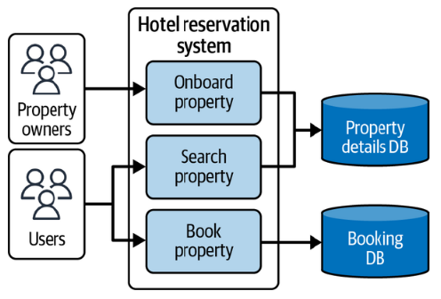
</center>

Ogni parte può essere ulteriormente suddivisa in sottosistemi più piccoli che si occupano di specifiche funzionalità.

Sofferiamoci ora sul primo sottosistema: **Onboarding delle proprietà**.

**RICAPITOLANDO**: questa era una panoramica ad alto livello del sistema anche in parte semplificata rispetto al libro, noi ci occuperemo, a livello di **progettazione** e **implemetnazione** solo del sottosistema di **onboarding delle proprietà** e della parte di ricerca delle proprietà da parte dell'user ma in maniera più semplificata rispetto alla soluzione adottata dal libro. **NON** ci occuperemo della parte di prenotazione delle proprietà (quindi non la modelleremo nè la implementeremo).

### **Property Onboarding Architecture**


Il requisito principale del sistema di **onboarding** è raccogliere i dati dai proprietari e salvarli in modo tale da rendere le ricerche rapide ed efficienti.  
Questo processo può essere visto come un flusso di lavoro a più stati (una sorta di *state machine*), in cui ogni fase gestisce input diversi, come mostrato in Figura.

<center>
    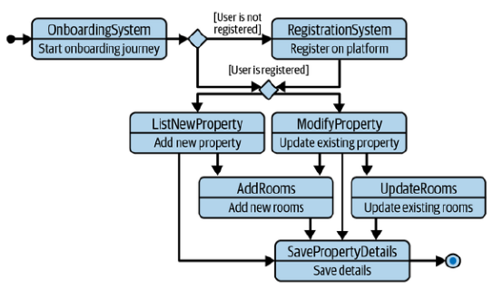
</center>

- Il primo stato riguarda la raccolta delle informazioni di base sulla proprietà, come nome, indirizzo, numero di stanze e servizi offerti. In questa fase si richiede che **l'owner sia autenticato** per poter inserire i dati.
- Una volta autenticato, l'owner può decidere se inserire una nuova proprietà o aggiornare una proprietà esistente. (CRUD)
  - Se sceglie di inserire una nuova proprietà, il sistema richiede ulteriori dettagli, come immagini della struttura, descrizione, regole della casa e politiche di cancellazione.
  - Se sceglie di aggiornare una proprietà esistente, il sistema recupera i dati correnti e permette all'owner di modificarli.
- Dopo aver inserito o aggiornato i dettagli della proprietà, il sistema salva le informazioni nel database e conferma l'avvenuta operazione all'owner.

#### **Scelta dell’architettura dati**

Un punto cruciale nella progettazione riguarda la **scelta del database** e del modello dei dati, in quanto le informazioni delle proprietà presentano sia componenti relazionali (relazioni tra proprietà, stanze, indirizzi) sia requisiti di flessibilità e scalabilità orizzontale.


##### **Opzione 1 — RDBMS (es. Amazon Aurora)**

Un modello relazionale è naturalmente adatto quando si gestiscono entità fortemente correlate:  
una *proprietà* appartiene a una *città*, contiene *camere*, e ciascuna camera può avere *servizi associati* (amenities) e *prezzi*.  

Un modello iniziale potrebbe includere tabelle come:

- `property` (dati principali)  
- `property_address`  
- `property_rooms`  
- `property_facilities`  
- `room_types`  

Questa struttura consente di garantire **consistenza ACID** nelle operazioni di onboarding, utile soprattutto quando più utenti aggiornano simultaneamente le informazioni relative a una stessa proprietà.  
L’utilizzo di **Amazon Aurora (PostgreSQL)** permette di mantenere una forte consistenza, con storage distribuito fino a 128 TB e replica automatica in più zone di disponibilità.  

Tuttavia, all’aumentare del volume di dati (milioni di proprietà e centinaia di milioni di stanze), un RDBMS può richiedere **sharding o partizionamento** per mantenere alte le prestazioni.

---

##### **Opzione 2 — DynamoDB (NoSQL, chiave–valore)**

Un’alternativa più scalabile è **Amazon DynamoDB**, che elimina la necessità di join complessi e supporta nativamente la **scalabilità orizzontale**.  
In DynamoDB, i dati sono organizzati in **item** all’interno di **tabelle**, ciascuna identificata da una chiave primaria.  
La chiave può essere:
- **semplice**, composta solo da una *partition key*, oppure  
- **composta**, costituita da una *partition key* e una *sort key*.

La *partition key* determina la distribuzione fisica dei dati, mentre la *sort key* consente di ordinare e raggruppare logicamente gli item correlati.

Nel modello di esempio per le proprietà:
- la **partition key** è `propertyId`, così tutti i dati relativi a una singola proprietà risiedono nella stessa partizione;
- la **sort key** differenzia i vari tipi di informazioni secondo convenzioni di naming, ad esempio:  
  - `PY` → dettagli principali della proprietà  
  - `PY#IMG#{imageId}` → immagini della proprietà  
  - `PY#R#{roomId}` → dati della stanza  
  - `PY#R#{roomType}#IMG#{imageId}` → immagini associate a una specifica stanza  

In questo modo, tramite query basate su `begins_with(sortKey, 'PY#R#')` è possibile recuperare tutte le stanze di una proprietà con una singola operazione di lettura, senza necessità di join.

Inoltre, DynamoDB consente di definire **indici secondari (GSI e LSI)** per supportare query alternative (es. per città, per owner, o per stato di pubblicazione).  
Questa architettura permette di ottenere latenze di lettura inferiori ai 10 ms e un throughput lineare all’aumentare del carico.

Per un sistema iniziale o a scala limitata, **Aurora** può risultare più comodo grazie al modello relazionale e alle garanzie di consistenza.  
Per un sistema su larga scala, con milioni di proprietà e aggiornamenti distribuiti, **DynamoDB** offre maggiore **scalabilità e semplicità operativa**, a costo di una minore flessibilità nelle query complesse.

---

## **Servizi e Architettura per AWS**


Come per la progettazione del sistema, suddivideremo l’architettura in sottosistemi e analizzeremo la **deployment view** dell'architettura del sistema di onboarding.

Concentriamoci solo sull'architettura iniziale del sottosistema di onboarding delle proprietà.

<center>
    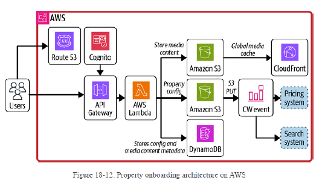
</center>

Gli utenti interagiscono con il sistema tramite **Amazon Route 53**, che fornisce un dominio unico e risolve le richieste verso **Amazon API Gateway**, il quale espone le API per la creazione e l’aggiornamento delle proprietà e integra l’autenticazione tramite **AWS Cognito**, che è un servizio gestito per l’autenticazione e l’autorizzazione degli utenti.

Il backend è gestito tramite **AWS Lambda**, che contiene la logica di business e interagisce con tre data store principali: una tabella **Amazon DynamoDB** e due bucket **Amazon S3**. DynamoDB memorizza le informazioni sulle proprietà secondo lo schema di onboarding, mentre un bucket S3 conserva i **media content**, come immagini e video delle stanze, e l’altro pubblica tutte le **configurazioni in formato statico**.

NOTA: **per il backend, al posto di avere un backend completamente serverless con aws lambda, potreemo anche utilizzare delle istanze EC2**.


Le configurazioni pubblicate su S3 fungono da **punto di riferimento coerente e stabile** per tutti i sistemi downstream. Ad esempio, il **sistema di ricerca** le legge per costruire indici ottimizzati per query complesse, mentre altri sistemi come pricing o analytics possono leggere gli stessi file JSON senza accedere direttamente a DynamoDB. Questo approccio riduce il coupling tra sistemi, consente versioning naturale dei dati e semplifica la gestione degli errori, poiché ogni snapshot rappresenta uno stato completo e consistente della proprietà, comprensivo di stanze, prezzi, servizi e disponibilità. CW Event in figura si riferisce a un cloudwatch event che si triggera su una put in S3.

L’uso diretto di **DynamoDB Streams** per popolare sistemi di ricerca o pricing è possibile ma sconsigliato. Gli stream inviano solo i delta delle modifiche, costringendo i consumer a ricostruire lo stato completo combinando eventi e record precedenti. Questo aumenta la complessità, la probabilità di incoerenze in caso di errori o fallimenti della Lambda, e crea un forte accoppiamento tra il modello dati di onboarding e i sistemi downstream. Al contrario, pubblicare snapshot statici su S3 permette di modellare i dati secondo le esigenze di ciascun sistema, mantenendo DynamoDB come database di origine ottimizzato per le operazioni CRUD e S3 come **interfaccia contrattuale** affidabile e scalabile.

Quindi ricapitolando: si salvano i dati delle proprietà in DynamoDB per operazioni veloci di CRUD, e poi periodicamente (o su eventi specifici) si generano snapshot completi in formato JSON che vengono salvati in S3. Questi snapshot servono come fonte di verità per altri sistemi che necessitano di leggere i dati delle proprietà, come il sistema di ricerca o di pricing. Per mantenere la consistenza tra DynamoDB e gli snapshot in S3, si può utilizzare una Lambda che si attiva su modifiche a DynamoDB (tramite DynamoDB Streams) o su eventi specifici, generando e salvando gli snapshot aggiornati in S3.

Questa architettura consente di separare chiaramente i ruoli tra backend, storage e sistemi di consumo dei dati, migliorando la coerenza, la resilienza e l’affidabilità complessiva del sistema.

NOTA: **Se si decide di non implementate il motore di ricerca come opensearch, ma di utilizzare un database relazionale o NoSQL per le ricerche, allora non è necessario pubblicare gli snapshot in S3. In questo caso, il sistema di ricerca può leggere direttamente da DynamoDB o dal database relazionale scelto.**

## **Infrastracture as Code e Deployment**

Per il deployment dell'infrastruttura AWS, si può utilizzare **Terraform** come strumento di Infrastructure as Code (IaC). Terraform consente di definire, configurare e gestire le risorse AWS in modo dichiarativo, facilitando il versionamento e la riproducibilità dell'infrastruttura.

### Componenti principali da gestire con Terraform

- **Amazon Cognito**: gestione di User Pool e App Client per l’autenticazione e l’autorizzazione dei proprietari.  
- **Amazon API Gateway**: esposizione delle API per creare, aggiornare e leggere i dati delle proprietà.  
- **AWS Lambda**: funzioni di backend per la logica di business, inclusa la generazione degli snapshot JSON delle proprietà. **In alternativa si possono utilizzare istanze EC2.** sempre tramite terraform.
- **Amazon DynamoDB**: tabella principale per memorizzare i dati delle proprietà, con chiave primaria e indici secondari.  
- **Amazon S3**:  
  - bucket per il **media content** (immagini e video delle proprietà e delle stanze);  
  - bucket per **configurazioni statiche**, snapshot JSON delle proprietà utilizzabili dagli altri sistemi.  
- **Amazon Route 53**: gestione del dominio e instradamento del traffico verso le API.  


## **Utilizzo di LocalStack per lo Sviluppo Locale**

Per facilitare lo sviluppo e il testing dell’infrastruttura AWS senza dover utilizzare risorse reali in cloud, è possibile integrare LocalStack nel flusso di lavoro. LocalStack fornisce un ambiente locale che emula i principali servizi AWS, come DynamoDB, S3, Lambda, API Gateway e Cognito, permettendo di testare le risorse in locale in modo rapido e sicuro.

La configurazione di LocalStack può essere gestita tramite Docker Compose, definendo i servizi necessari per l’emulazione. Inoltre, Terraform può essere configurato per puntare a LocalStack durante lo sviluppo locale, consentendo di creare e gestire le risorse AWS simulate.

<center>
    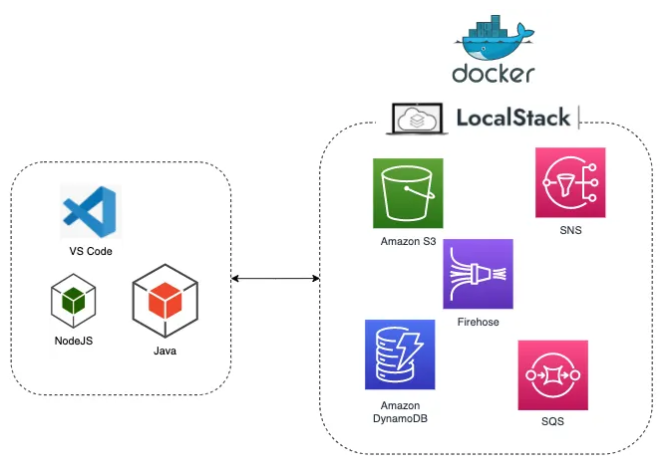
</center>


## **Progettazione UML**

### **Use Case Diagram**
Cominciamo da un diagramma dei casi d'uso (use case diagram) per il sottosistema di onboarding delle proprietà.

<!--  -->
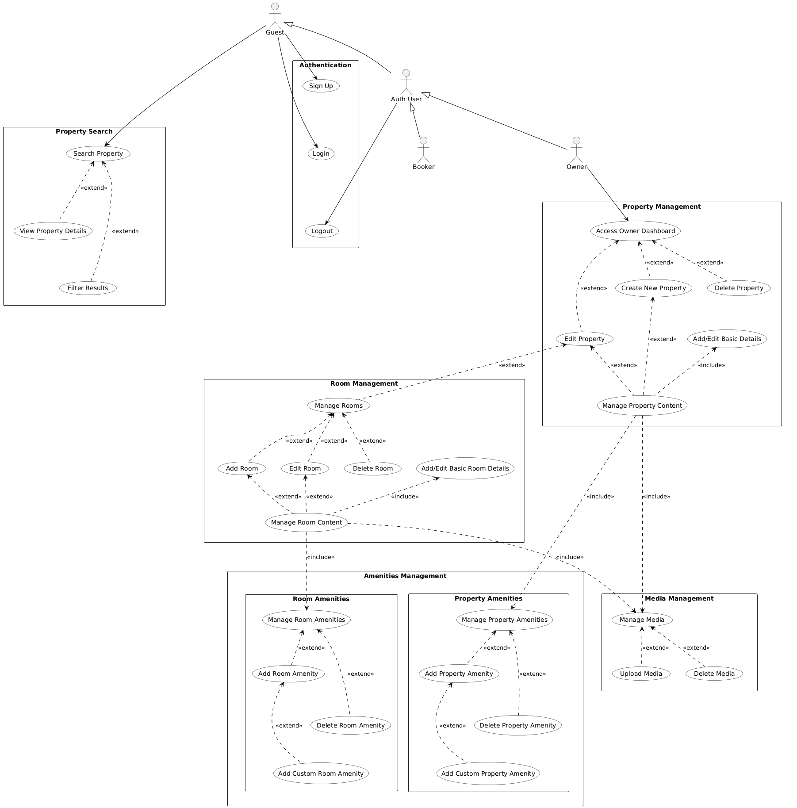

Il diagramma dei casi d’uso rappresenta le funzionalità principali del sottosistema di **onboarding delle proprietà** e della **ricerca delle proprietà**, mettendo in evidenza i diversi tipi di utenti e i permessi associati a ciascuno.

Partiamo dagli **attori**. Abbiamo l’attore generico **User**, che rappresenta qualsiasi visitatore del sistema, sia autenticato sia non autenticato. Da **User** derivano due specializzazioni: **Customer** e **Property Owner**.  

- Il **Customer** è l’utente finale che naviga il sito, cerca le proprietà e, eventualmente, in futuro potrà prenotare. Per il momento, nel diagramma, **la prenotazione non è modellata**.  
- Il **Property Owner** è chi possiede e gestisce le strutture ricettive: può registrarsi, accedere al sistema e gestire le proprie proprietà.

Quando un utente si autentica, entra in gioco l’attore **Authenticated User**. Questo attore rappresenta **tutti gli utenti loggati**, sia Customer sia Owner.  
In pratica:  
- se un **Property Owner** è autenticato, può accedere alle funzionalità di onboarding e gestione delle proprietà;  
- se un **Customer** è autenticato, potrà in futuro prenotare, ma oggi può solo **cercare proprietà** come un utente generico.

Il diagramma è suddiviso in **pacchetti funzionali** per rendere più chiara la visione delle responsabilità:

1. **Authentication**  
   Qui sono raccolti i casi d’uso relativi a registrazione e login. Un utente può **registrarsi**, effettuare il **login** o il **logout**. La registrazione include obbligatoriamente l’**inserimento dei dati personali**, indicato con `<<include>>`, perché è parte integrante del processo.

2. **Property Management**  
   In questo pacchetto si concentrano tutte le operazioni disponibili per i **Property Owner autenticati**.  
   Possono:  
   - **Visualizzare l’elenco delle proprie proprietà**  
   - **Creare nuove proprietà**  
   - **Aggiornare proprietà esistenti**  

   La **creazione** o l’**aggiornamento** include sempre la **gestione delle stanze**, mentre il **caricamento dei media** (immagini, video) è opzionale, modellato come `<<extend>>`.  
   Durante l’aggiornamento, è possibile anche **eliminare la proprietà**, ma questo è considerato un caso estendibile, non obbligatorio.  
   La **gestione delle stanze**, a sua volta, include la possibilità di **aggiungere, modificare o eliminare singole stanze**.

3. **Property Search**  
   Questo pacchetto raccoglie le funzionalità di ricerca, **accessibili a tutti gli utenti**, sia anonimi sia autenticati.  
   La ricerca include sempre la possibilità di **visualizzare i dettagli della proprietà**, mentre l’**applicazione di filtri** è opzionale (`<<extend>>`).  

In questo modo, il diagramma mostra chiaramente:  
- la **separazione dei ruoli e dei privilegi**;  
- quali operazioni sono **obbligatorie** e quali sono **opzionali**;  
- come i diversi casi d’uso si collegano tra loro tramite `<<include>>` e `<<extend>>`.


#### **Descrizione degli Scenari Principali**


##### **Autenticazione Utenti**

| Nome caso d’uso                     | SignUp                                                                                                                                                 |
| ----------------------------------- | -------------------------------------------------------------------------------------------------------------------------------------------------------- |
| **Descrizione**                     | Permette a un nuovo utente di creare un account nel sistema, inserendo i propri dati personali.                                                          |
| **Attori**                          | User, Property Owner, Customer                                                                                                                                     |
| **Precondizioni**                   | L’utente non deve avere un account esistente.                                                                                                            |
| **Postcondizioni**                  | L’utente è registrato e può effettuare il login.                                                                                                         |
| **Flusso principale degli eventi**  | 1. L’utente seleziona l’opzione di registrazione.<br>2. Inserisce i dati personali richiesti.<br>3. Il sistema salva i dati e conferma la registrazione. |
| **Flusso alternativo degli eventi** | 2a. Dati mancanti o non validi: il sistema richiede correzione.<br>2b. L’utente annulla la registrazione: nessun dato viene salvato.                     |
| **Requisiti speciali**              | Validazione dei dati, gestione errori, sicurezza dei dati personali.                                                                                     |

---

| Nome caso d’uso                     | Enter Personal Data                                                                                                                                                                                         |
| ----------------------------------- | ----------------------------------------------------------------------------------------------------------------------------------------------------------------------------------------------------------- |
| **Descrizione**                     | Permette a un nuovo utente di inserire le informazioni personali richieste per completare la registrazione.                                                                                                 |
| **Attori**                          | User, Property Owner, Customer                                                                                                                                       |
| **Precondizioni**                   | L’utente deve aver avviato la registrazione.                                                                                                                                                                |
| **Postcondizioni**                  | I dati personali sono salvati nel sistema e l’utente può completare la registrazione.                                                                                                                       |
| **Flusso principale degli eventi**  | 1. L’utente seleziona l’opzione per inserire dati personali.<br>2. L’utente compila il modulo con nome, cognome, email, password e altre informazioni richieste.<br>3. Il sistema valida i dati e li salva. |
| **Flusso alternativo degli eventi** | 2a. Dati incompleti o non validi: il sistema mostra un messaggio di errore e richiede la correzione.<br>2b. L’utente annulla l’inserimento: nessun dato viene salvato.                                      |
| **Requisiti speciali**              | Validazione dei dati, gestione sicura delle informazioni.                                                                                                                                  |

---

| Nome caso d’uso                     | Login                                                                                                                                                       |
| ----------------------------------- | ----------------------------------------------------------------------------------------------------------------------------------------------------------- |
| **Descrizione**                     | Permette a un utente registrato di autenticarsi nel sistema.                                                                                                |
| **Attori**                          | User, Property Owner, Customer                                                                                   |
| **Precondizioni**                   | L’utente deve avere un account registrato.                                                                                                                  |
| **Postcondizioni**                  | L’utente è autenticato e può accedere alle funzionalità riservate secondo il ruolo.                                                                         |
| **Flusso principale degli eventi**  | 1. L’utente inserisce le credenziali.<br>2. Il sistema verifica le credenziali.<br>3. Se corrette, l’utente viene autenticato.                              |
| **Flusso alternativo degli eventi** | 2a. Credenziali errate: il sistema mostra un messaggio di errore e richiede reinserimento.<br>2b. L’utente annulla il login: nessuna sessione viene creata. |
| **Requisiti speciali**              | Gestione sicura delle credenziali, protezione da brute force.                                                                                               |

---

| Nome caso d’uso                     | Logout                                                                                              |
| ----------------------------------- | --------------------------------------------------------------------------------------------------- |
| **Descrizione**                     | Permette a un utente autenticato di terminare la sessione.                                          |
| **Attori**                          | Authenticated User                                                                                  |
| **Precondizioni**                   | L’utente deve essere autenticato.                                                                   |
| **Postcondizioni**                  | L’utente viene disconnesso e non può più accedere alle funzionalità riservate senza nuovo login.    |
| **Flusso principale degli eventi**  | 1. L’utente seleziona il logout.<br>2. Il sistema termina la sessione e conferma la disconnessione. |
| **Flusso alternativo degli eventi** | 1a. La sessione era già scaduta: il sistema conferma comunque l’uscita.                             |
| **Requisiti speciali**              | Sicurezza della sessione, gestione corretta dello stato dell’utente.                                |

---

##### **Gestione Proprietà**

| Nome caso d’uso                     | Create New Property                                                                                                                                                                             |
| ----------------------------------- | ----------------------------------------------------------------------------------------------------------------------------------------------------------------------------------------------- |
| **Descrizione**                     | Permette all’owner autenticato di inserire una nuova proprietà nel sistema, configurando stanze, prezzi, amenities e caricando media.                                                           |
| **Attori**                          | Authenticated User (Property Owner)                                                                                                                                                             |
| **Precondizioni**                   | L’owner deve essere autenticato.                                                                                                                                                                |
| **Postcondizioni**                  | La nuova proprietà è memorizzata nel database. In seguito l'owner potrà aggiungere le rooms.                                                                                                                                                |
| **Flusso principale degli eventi**  | 1. L’owner seleziona “Create New Property”.<br>2. L’owner può caricare media opzionali.<br>3. Il sistema salva la proprietà. |
| **Flusso alternativo degli eventi** | 2a. Dati incompleti o non validi: il sistema mostra un messaggio di errore e richiede correzione.                                                                                               |
| **Requisiti speciali**              | Validazione dei dati di input, gestione errori di caricamento media.                                                                                                                            |

---

| Nome caso d’uso                     | Update Existing Property                                                                                                                                |
| ----------------------------------- | ------------------------------------------------------------------------------------------------------------------------------------------------------- |
| **Descrizione**                     | Permette all’owner autenticato di modificare i dettagli di una proprietà già presente nel sistema, comprese stanze, prezzi, media e altre informazioni. |
| **Attori**                          | Authenticated User (Property Owner)                                                                                                                     |
| **Precondizioni**                   | L’owner deve essere autenticato. La proprietà deve esistere nel sistema.                                                                                |
| **Postcondizioni**                  | Le modifiche alla proprietà vengono salvate nel database.                                                                                               |
| **Flusso principale degli eventi**  | 1. L’owner seleziona la proprietà da aggiornare.<br>2. L’owner modifica i dettagli desiderati.<br>3. Il sistema salva le modifiche.                     |
| **Flusso alternativo degli eventi** | 2a. Dati non validi: il sistema mostra un messaggio di errore.<br>2b. L’owner annulla l’aggiornamento: i dati rimangono invariati.                      |
| **Requisiti speciali**              | Validazione dei dati, gestione errori di caricamento media.                                                                                             |

---


| Nome caso d’uso                     | Delete Property                                                                                                                                                                                                                                                                                                                                                              |
| ----------------------------------- | ---------------------------------------------------------------------------------------------------------------------------------------------------------------------------------------------------------------------------------------------------------------------------------------------------------------------------------------------------------------------------- |
| **Descrizione**                     | Permette all’owner autenticato di rimuovere una proprietà esistente dal sistema. La cancellazione include tutte le stanze associate e tutti i media collegati sia alla proprietà sia alle stanze.                                                                                                                                                                            |
| **Attori**                          | Authenticated User (Property Owner)                                                                                                                                                                                                                                                                                                                                          |
| **Precondizioni**                   | L’owner deve essere autenticato. La proprietà deve esistere nel sistema.                                                                                                                                                                                                                                                                                                     |
| **Postcondizioni**                  | La proprietà, tutte le stanze collegate e tutti i media associati vengono rimossi dal database.                                                                                                                                                                                                                                                                              |
| **Flusso principale degli eventi**  | 1. L’owner seleziona la proprietà da eliminare.<br>2. Il sistema richiede conferma esplicita.<br>3. Dopo conferma, il sistema elimina tutti i media collegati alla property.<br>4. Il sistema elimina ciascuna stanza collegata, cancellando per ogni stanza anche i media associati.<br>5. La proprietà viene rimossa e l’owner riceve conferma dell’avvenuta eliminazione. |
| **Flusso alternativo degli eventi** | 2a. L’owner annulla l’operazione prima della conferma: la proprietà, le stanze e i media rimangono invariati.                                                                                                                                                                                                                                                                |
| **Requisiti speciali**              | Conferma esplicita dell’utente prima della cancellazione. La rimozione deve garantire che non rimangano dati orfani di stanze o media.                                                                                                                                                                                                                                       |


---


| Nome caso d’uso                     | Upload Media                                                                                                                                      |
| ----------------------------------- | ------------------------------------------------------------------------------------------------------------------------------------------------- |
| **Descrizione**                     | Permette all’owner di caricare immagini o altri media relativi a una proprietà o alle sue stanze.                                                 |
| **Attori**                          | Authenticated User (Property Owner)                                                                                                               |
| **Precondizioni**                   | L’owner deve essere autenticato. La proprietà deve esistere.                                                                                      |
| **Postcondizioni**                  | I media vengono salvati nel sistema e associati alla proprietà.                                                                                   |
| **Flusso principale degli eventi**  | 1. L’owner seleziona la proprietà.<br>2. L’owner carica le immagini o i media desiderati.<br>3. Il sistema salva i media.                         |
| **Flusso alternativo degli eventi** | 2a. File non valido o troppo grande: il sistema mostra un messaggio di errore.<br>2b. L’owner annulla il caricamento: i dati rimangono invariati. |
| **Requisiti speciali**              | Controllo dimensione e tipo dei file, gestione errori di caricamento.                                                                             |

---

| Nome caso d’uso                     | Manage Rooms                                                                                                                                             |
| ----------------------------------- | -------------------------------------------------------------------------------------------------------------------------------------------------------- |
| **Descrizione**                     | Permette all’owner di aggiungere, modificare o rimuovere stanze associate a una proprietà.                                                               |
| **Attori**                          | Authenticated User (Property Owner)                                                                                                                      |
| **Precondizioni**                   | L’owner deve essere autenticato. La proprietà deve esistere.                                                                                             |
| **Postcondizioni**                  | Le modifiche alle stanze vengono salvate nel database.                                                                                                   |
| **Flusso principale degli eventi**  | 1. L’owner seleziona la gestione delle stanze per una proprietà.<br>2. L’owner aggiunge, modifica o rimuove stanze.<br>3. Il sistema salva le modifiche. |
| **Flusso alternativo degli eventi** | 2a. Inserimento dati non valido: il sistema richiede correzione.<br>2b. L’owner annulla l’operazione: i dati rimangono invariati.                        |
| **Requisiti speciali**              | Controllo validità dei dati delle stanze, gestione degli errori.                                                                                         |


---

| Nome caso d’uso                     | Add Room                                                                                                                                                                          |
| ----------------------------------- | --------------------------------------------------------------------------------------------------------------------------------------------------------------------------------- |
| **Descrizione**                     | Permette all’owner autenticato di aggiungere una nuova stanza a una proprietà esistente.                                                                                          |
| **Attori**                          | Authenticated User (Property Owner)                                                                                                                                               |
| **Precondizioni**                   | L’owner deve essere autenticato. La proprietà deve esistere.                                                                                                                      |
| **Postcondizioni**                  | La nuova stanza viene salvata nel database e associata alla proprietà.                                                                                                            |
| **Flusso principale degli eventi**  | 1. L’owner seleziona la gestione delle stanze per una proprietà.<br>2. Inserisce i dettagli della nuova stanza (tipo, numero, prezzo, servizi).<br>3. Il sistema salva la stanza. |
| **Flusso alternativo degli eventi** | 2a. Dati incompleti o non validi: il sistema mostra un messaggio di errore e richiede correzione.<br>2b. L’owner annulla l’inserimento: nessuna modifica viene effettuata.        |
| **Requisiti speciali**              | Validazione dei dati della stanza, gestione errori..                                                                                 |

---

| Nome caso d’uso                     | Edit Room                                                                                                                                                  |
| ----------------------------------- | ---------------------------------------------------------------------------------------------------------------------------------------------------------- |
| **Descrizione**                     | Permette all’owner autenticato di modificare i dettagli di una stanza esistente all’interno di una proprietà.                                              |
| **Attori**                          | Authenticated User (Property Owner)                                                                                                                        |
| **Precondizioni**                   | L’owner deve essere autenticato. La proprietà e la stanza devono esistere.                                                                                 |
| **Postcondizioni**                  | Le modifiche alla stanza vengono salvate nel database e associate alla proprietà.                                                                          |
| **Flusso principale degli eventi**  | 1. L’owner seleziona la stanza da modificare.<br>2. Aggiorna i dettagli della stanza (tipo, numero, prezzo, servizi).<br>3. Il sistema salva le modifiche. |
| **Flusso alternativo degli eventi** | 2a. Dati non validi: il sistema mostra un messaggio di errore e richiede correzione.<br>2b. L’owner annulla la modifica: i dati rimangono invariati.       |
| **Requisiti speciali**              | Validazione dei dati della stanza, gestione errori.                                                          |

---

| Nome caso d’uso                     | Delete Room                                                                                                                              |
| ----------------------------------- | ---------------------------------------------------------------------------------------------------------------------------------------- |
| **Descrizione**                     | Permette all’owner autenticato di rimuovere una stanza esistente da una proprietà.                                                       |
| **Attori**                          | Authenticated User (Property Owner)                                                                                                      |
| **Precondizioni**                   | L’owner deve essere autenticato. La proprietà e la stanza devono esistere.                                                               |
| **Postcondizioni**                  | La stanza viene rimossa dal database e aggiornata nella proprietà associata.                                                             |
| **Flusso principale degli eventi**  | 1. L’owner seleziona la stanza da eliminare.<br>2. Conferma l’eliminazione.<br>3. Il sistema cancella la stanza e aggiorna la proprietà. |
| **Flusso alternativo degli eventi** | 2a. L’owner annulla l’operazione: la stanza rimane invariata.<br>2b. La stanza non esiste più: il sistema mostra un messaggio di errore. |
| **Requisiti speciali**              | Conferma esplicita dell’utente, gestione errori.                                           |

---


##### **Ricerca Proprietà**

| Nome caso d’uso | Search Property                                                                                                                 |
| --------------- | ------------------------------------------------------------------------------------------------------------------------------- |
| **Descrizione** | Permette a qualsiasi utente, autenticato o no, di cercare proprietà disponibili secondo criteri di località, date e preferenze. |
| **Attori**      |     User, Authenticated User                                                                                                         |
| **Precondizioni**                   | Nessuna, la ricerca è accessibile anche senza autenticazione.                                         |
| **Postcondizioni**                  | Viene restituita la lista delle proprietà corrispondenti ai criteri di ricerca.                       |
| **Flusso principale degli eventi**  | 1. L’utente seleziona l’opzione di ricerca.<br>2. Inserisce criteri di ricerca come località e date.<br>3. Il sistema restituisce i risultati corrispondenti. |
| **Flusso alternativo degli eventi** | 2a. Nessun risultato trovato: il sistema mostra un messaggio informativo.<br>2b. L’utente annulla la ricerca: il sistema torna alla pagina principale. |
| **Requisiti speciali**              | Supporto a filtri opzionali, gestione query, prestazioni rapide nella restituzione dei risultati. |

---

| Nome caso d’uso                     | View Property Details                                                                                                                                             |
| ----------------------------------- | ----------------------------------------------------------------------------------------------------------------------------------------------------------------- |
| **Descrizione**                     | Permette all’utente di visualizzare i dettagli completi di una proprietà selezionata dalla ricerca, inclusi stanze, servizi e media.                              |
| **Attori**                          | User, Authenticated User                                                                                                                                          |
| **Precondizioni**                   | La proprietà deve esistere nel sistema.                                                                                                                           |
| **Postcondizioni**                  | Vengono mostrati tutti i dettagli della proprietà selezionata.                                                                                                    |
| **Flusso principale degli eventi**  | 1. L’utente seleziona una proprietà dai risultati della ricerca.<br>2. Il sistema recupera i dettagli dal database.<br>3. I dettagli vengono mostrati all’utente. |
| **Flusso alternativo degli eventi** | 2a. La proprietà non esiste più: il sistema mostra un messaggio di errore.                                                                                        |
| **Requisiti speciali**              | Accesso sicuro ai dati della proprietà, caricamento corretto dei media.                                                                                           |

---

| Nome caso d’uso                     | Filter Results                                                                                                                                                        |
| ----------------------------------- | --------------------------------------------------------------------------------------------------------------------------------------------------------------------- |
| **Descrizione**                     | Permette all’utente di applicare filtri opzionali ai risultati della ricerca, come tipo di stanza, servizi inclusi o valutazioni.                                     |
| **Attori**                          | User, Authenticated User                                                                                                                                              |
| **Precondizioni**                   | L’utente deve aver eseguito una ricerca delle proprietà.                                                                                                              |
| **Postcondizioni**                  | La lista dei risultati viene aggiornata secondo i filtri selezionati.                                                                                                 |
| **Flusso principale degli eventi**  | 1. L’utente seleziona i filtri desiderati.<br>2. Il sistema aggiorna i risultati secondo i criteri scelti.                                                            |
| **Flusso alternativo degli eventi** | 1a. Nessun risultato corrispondente ai filtri: il sistema mostra un messaggio informativo.<br>1b. L’utente rimuove i filtri: i risultati tornano alla lista completa. |
| **Requisiti speciali**              | Aggiornamento dinamico dei risultati, gestione efficiente dei filtri opzionali.                                                                                       |

---


### **Class Diagram di Analisi**


<!-- 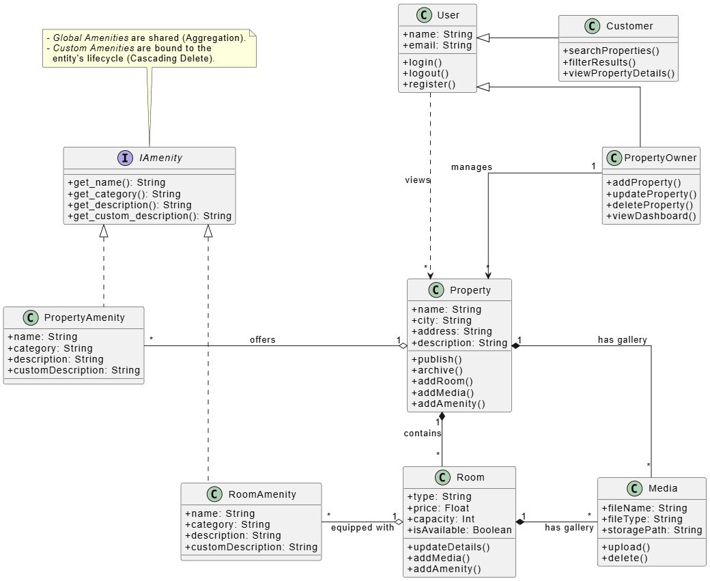 -->

Il diagramma di classi di analisi rappresenta i principali concetti del dominio e le loro relazioni, senza entrare ancora nei dettagli implementativi o nelle strutture dati specifiche.

Partiamo dagli utenti: **User** è la superclasse comune da cui derivano **PropertyOwner** e **Customer**, per distinguere le funzionalità disponibili in base al ruolo. Tutti gli utenti possono registrarsi e loggarsi, ma solo i proprietari autenticati possono gestire le proprie proprietà. Questa distinzione è rappresentata da associazioni di tipo **generalizzazione** tra User e le sue sottoclassi.

Per quanto riguarda le proprietà:

- **Property** contiene informazioni principali come nome, indirizzo, descrizione e amenities generali.
- Ogni proprietà è legata a **più stanze** tramite una **composizione**: `Property "1" *-- "*" Room : contains`. La composizione indica che le stanze non esistono indipendentemente dalla proprietà; se la proprietà viene eliminata, anche le stanze vengono automaticamente eliminate.
- Sia **Property** sia **Room** hanno **media** associati tramite **composizione**: `Property "1" *-- "*" Media : has` e `Room "1" *-- "*" Media : has`. Questo riflette la regola che i media devono essere eliminati se la proprietà o la stanza viene rimossa, anche se fisicamente i file possono essere conservati altrove (ad esempio in uno storage esterno come S3).

**PropertyOwner** è collegato alle proprie proprietà tramite un’associazione normale con molteplicità `1 --> *`, indicando che un owner possiede una o più proprietà, ma le proprietà non fanno parte integrante dell’owner (non è una composizione).

Infine, gli user (possono essere sia proprietari che clienti) hanno la capacità di visualizzare le proprietà tramite un’associazione normale `User --> "*" Property : views`, che rappresenta la funzionalità di ricerca e visualizzazione delle proprietà disponibili.

Ricapitolando:
- **Generalizzazione** tra User e le sottoclassi (PropertyOwner, Customer).
- **Composizione** tra Property e Room: le stanze dipendono dalla proprietà.
- **Composizione** tra Property/Room e Media: i media dipendono dall’esistenza della property/room.
- **Associazioni normali** per le relazioni “possiede” (PropertyOwner -> Property).


### **Sequence Diagram di Analisi**

Il diagramma mostra le interazioni principali tra un attore esterno chiamato `UserActor` e un oggetto `User` del sistema durante le operazioni di registrazione, login e logout. L’attore esterno rappresenta l’utente reale che interagisce con il sistema, mentre l’oggetto `User` rappresenta la classe interna del sistema che gestisce le informazioni e le operazioni dell’utente. La **lifeline** dell’oggetto `User` indica la sua esistenza nel corso della sequenza, e lungo questa linea vengono mostrati dei rettangoli chiamati **activation box** che evidenziano il periodo in cui l’oggetto è attivo ed elabora un messaggio.

Durante la registrazione, l’attore esterno invia un messaggio `signup()` all’oggetto `User`. L’oggetto diventa attivo e chiama internamente il metodo `enterPersonalData()`. Se i dati inseriti dall’utente sono validi, il sistema restituisce una conferma di registrazione; in caso contrario, richiede la correzione dei dati.

Nel caso del login, l’attore invia il messaggio `login()` all’oggetto `User`, che si attiva per verificare le credenziali. Se le credenziali sono corrette, l’oggetto restituisce un messaggio di autenticazione riuscita, altrimenti mostra un messaggio di errore e consente il reinserimento.

Per il logout, l’attore invia `logout()` all’oggetto `User`, che si attiva brevemente per terminare la sessione e invia conferma all’attore esterno.

È importante distinguere l’attore esterno dall’oggetto interno anche se rappresentano la stessa persona concettuale, perché l’attore non ha comportamenti interni al sistema, mentre l’oggetto `User` esegue i metodi e mantiene lo stato. Le frecce rappresentano i messaggi sincroni e di ritorno, e i blocchi condizionali `alt` mostrano i flussi alternativi in base ai dati forniti o alla correttezza delle credenziali. L’uso delle **activation box** permette di visualizzare chiaramente quando l’oggetto sta elaborando un’operazione e quando termina l’esecuzione del metodo.

**Creation of a New Property**

<!--  -->
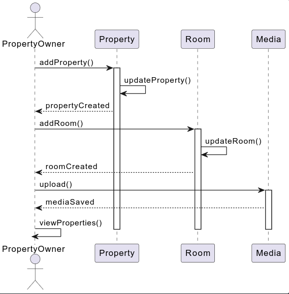

In questo diagramma di sequenza, l’attore PropertyOwner rappresenta un utente autenticato che gestisce le proprie proprietà. La sequenza inizia quando l’owner decide di creare una nuova proprietà. La chiamata parte dall’attore verso l’oggetto Property tramite il metodo addProperty(), che rappresenta la richiesta di creazione. Property si attiva e chiama internamente updateProperty() per aggiornare i dettagli della nuova proprietà; al termine, Property risponde all’owner confermando che la proprietà è stata creata, e l’oggetto Property viene disattivato.

Successivamente, l’owner gestisce le stanze associate alla proprietà. La chiamata va dall’owner verso l’oggetto Room tramite il metodo addRoom(), che rappresenta la creazione o modifica di una stanza. L’oggetto Room si attiva, esegue updateRoom() per aggiornare i dettagli della stanza e infine risponde all’owner confermando la creazione o modifica della stanza, quindi Room si disattiva.

Dopo la gestione delle stanze, l’owner può caricare media associati alla proprietà. La chiamata parte dall’owner verso l’oggetto Media tramite il metodo upload(). Media si attiva, salva i file e risponde all’owner confermando l’avvenuto salvataggio, quindi si disattiva.

Infine, l’owner può visualizzare la lista delle proprietà tramite il metodo viewProperties() sul proprio oggetto, completando il flusso di creazione e gestione di una nuova proprietà. Il diagramma rappresenta chiaramente le attivazioni degli oggetti lungo le linee temporali e mostra la sequenza logica coerente con i metodi definiti nel class diagram, rispettando la corretta direzione delle frecce dagli attori verso gli oggetti.

**Update Existing Property**


<!-- 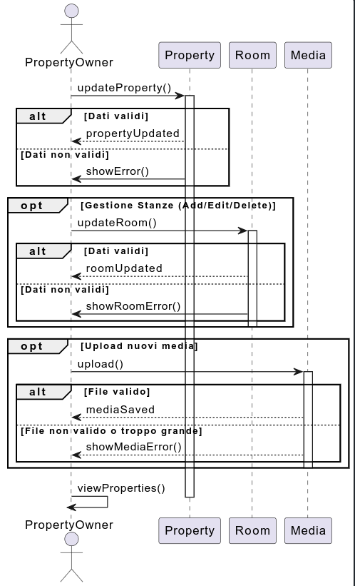 -->

In questo scenario, l’owner invia una richiesta di aggiornamento alla proprietà esistente. Property esegue updateProperty() e risponde confermando l’aggiornamento. Successivamente l’owner può gestire le stanze tramite updateRoom(), e infine caricare eventuali nuovi media. La sequenza termina con la visualizzazione aggiornata delle proprietà dall’owner.

**Delete Property**


<!-- 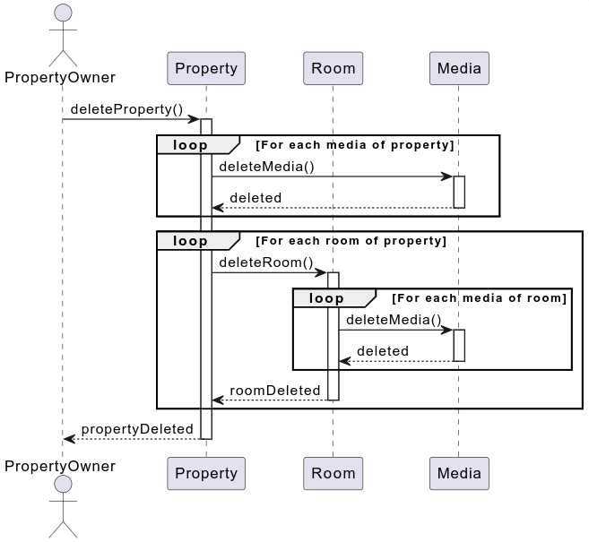 -->

Il diagramma mostra come un **Property Owner** elimina una proprietà dal sistema. L’owner avvia l’operazione chiamando il metodo `deleteProperty()` sulla property desiderata. Prima di cancellare la property stessa, vengono rimossi tutti i media ad essa associati: la property chiama `delete()` su ciascun media e riceve conferma della cancellazione. Successivamente, tutte le stanze collegate alla property vengono rimosse; per ciascuna stanza, la property invoca `deleteRoom()`, che a sua volta cancella tutti i media associati alla stanza. Una volta completata la rimozione dei media di ogni stanza, la stanza stessa viene eliminata e conferma la sua cancellazione alla property. Quando tutte le stanze e tutti i media sono stati rimossi, la property viene definitivamente cancellata e restituisce al Property Owner la conferma `propertyDeleted`, completando l’intera operazione di eliminazione.


**Search Property**


<!-- 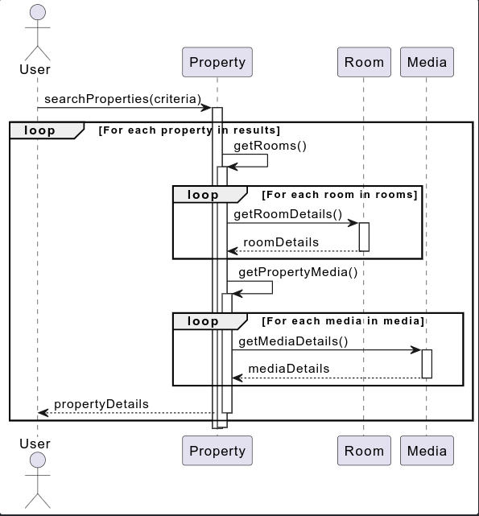 -->

In questo scenario, l’utente avvia la ricerca delle proprietà tramite il metodo `searchProperties()` definito nella classe `User`. Questo metodo accetta i criteri di ricerca, come località, date o preferenze, e restituisce l’elenco delle proprietà corrispondenti. Per ogni proprietà trovata, il sistema chiama internamente i metodi `getRooms()` e `getMedia()` della classe `Property` per recuperare rispettivamente l’elenco delle stanze e dei media associati alla proprietà.

Ogni stanza viene poi interrogata tramite il suo metodo `getDetails()`, che restituisce le informazioni relative al tipo, prezzo, capacità e servizi disponibili. Allo stesso modo, ciascun media associato alla proprietà viene recuperato tramite `getDetails()` della classe `Media`, ottenendo informazioni come file path, tipo e descrizione.

Quando tutte le stanze e i media della proprietà sono stati raccolti, la proprietà completa, con tutti i dettagli delle stanze e dei media, viene restituita all’utente. Il diagramma rappresenta quindi un flusso sequenziale in cui l’utente riceve progressivamente tutte le informazioni necessarie sulle proprietà corrispondenti ai criteri di ricerca, senza necessità di un metodo separato di “view full property”. L’utente interagisce solo con `searchProperties()`, mentre tutte le aggregazioni di stanze e media sono gestite dalle rispettive classi associate.


### **Diagramma di Attività**

<!--  -->
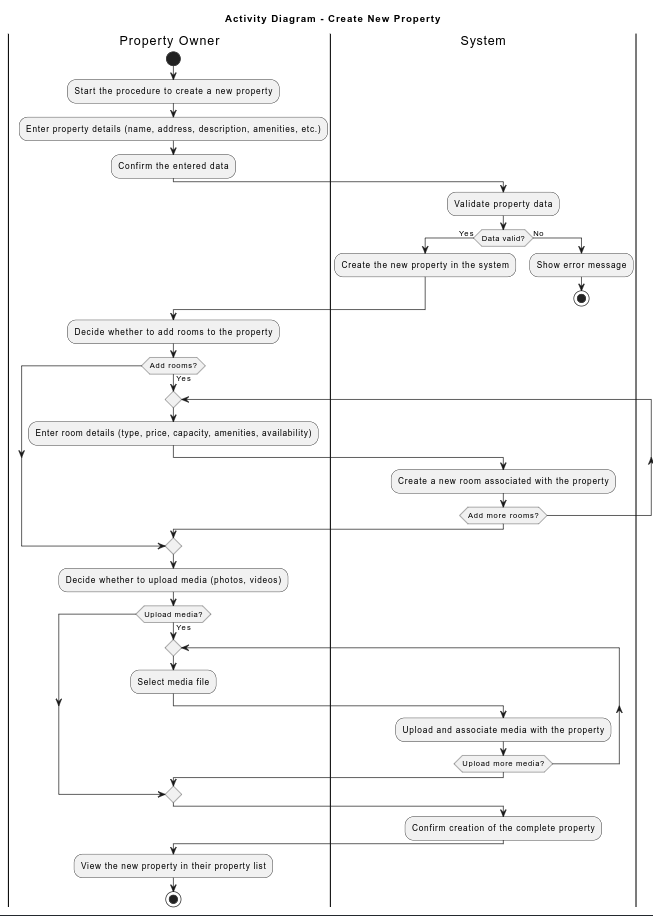

L’attività inizia quando il Property Owner sceglie di creare una nuova proprietà e inserisce i dati necessari. Il sistema valida le informazioni e, se corrette, registra la nuova proprietà. Successivamente, l’owner può opzionalmente aggiungere una o più stanze e caricare media associati (foto o video). Infine, il sistema conferma l’avvenuta creazione e mostra la proprietà nella lista personale dell’utente.


### **BPMN**

**Create new Property BPMN**
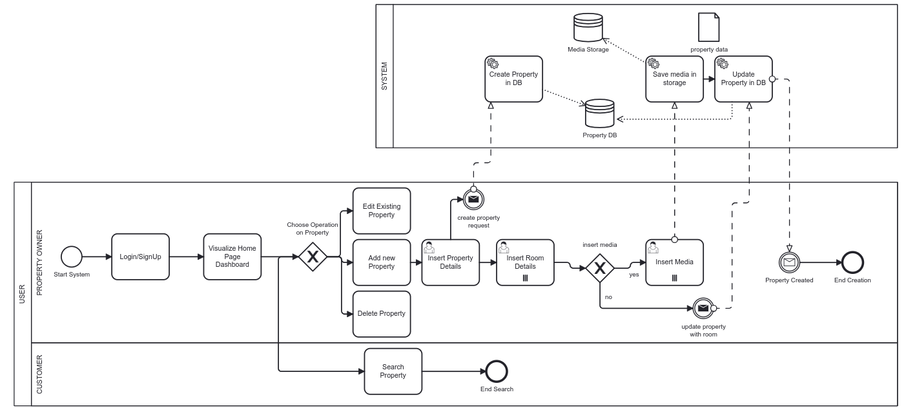

Il diagramma rappresenta un processo di gestione e creazione di proprietà (con stanze e eventualmente media) nel sistema, mostrando le interazioni tra due ruoli principali: Property Owner (proprietario della proprietà) e Customer (cliente), e il sistema stesso.

Il flusso inizia quando l’utente entra nel sistema, passando attraverso il login o la registrazione. Dopo il login, il proprietario visualizza il dashboard della home page, da cui può scegliere l’operazione da compiere sulla proprietà: modificare una proprietà esistente, aggiungerne una nuova oppure eliminarne una. Se decide di aggiungere una nuova proprietà, deve inserire prima i dati della proprietà e poi i dettagli delle stanze.

A questo punto viene chiesto se vuole inserire media (foto o video). Se la risposta è sì, il proprietario carica i media. Questi vengono salvati nel media storage del sistema, e successivamente i dati della proprietà vengono creati nel database. Alla fine, il sistema invia una notifica di conferma al proprietario e il processo di creazione termina.

Se il proprietario decide di non inserire media, viene comunque generata una richiesta di creazione della proprietà, che passa al sistema per essere registrata.

Il Customer, invece, ha solo la possibilità di cercare proprietà e terminare la ricerca, senza interagire con la creazione o modifica delle proprietà. 

---

### **Class Diagram di Design**


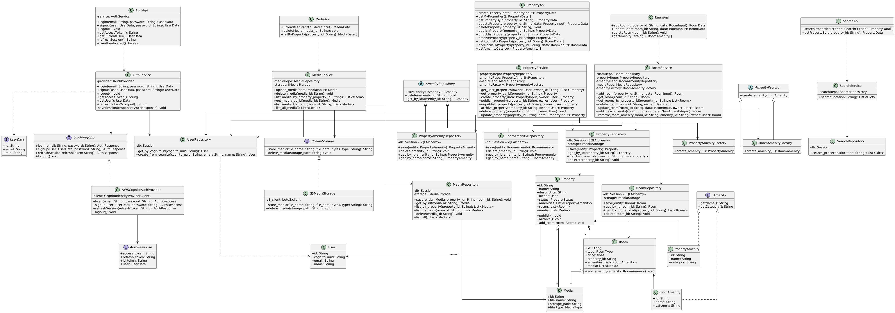


Il **Diagramma delle Classi di Design** formalizza il passaggio dal modello concettuale alla specifica tecnica, definendo una struttura software che può essere direttamente implementata. A differenza del modello di analisi, questo include dettagli della soluzione tecnica, raffinando le entità attraverso:

- **Tipizzazione e Visibilità:** qui si definiscono con precisione i tipi di dato per gli attributi e i livelli di accesso (public, private, protected) per garantire il corretto incapsulamento e proteggere lo stato interno.  
- **Firme dei Metodi:** specifica completa delle operazioni, con parametri di input e valori di ritorno, trasformando le descrizioni funzionali in veri contratti software.  
- **Navigabilità:** le relazioni hanno un verso preciso per stabilire in modo chiaro i riferimenti tra le classi, cosa fondamentale per tradurle in codice e schemi di database.  

In questa fase, modellare bene le relazioni diventa particolarmente importante: si distingue chiaramente tra **aggregazione** e **composizione** in base a quanto il ciclo di vita delle parti dipende dal tutto, e si usano le **interfacce** per disaccoppiare le specifiche dall'implementazione, favorendo il polimorfismo.

La struttura rispetta rigorosamente la stratificazione definita nell'architettura:

- **API Layer (Client Interface):** classi come `PropertyApi` agiscono come punto di ingresso. Non contengono logica di business, ma si limitano a ricevere i DTO (Data Transfer Objects) di input, invocare i servizi sottostanti e restituire i dati trasformati.  
- **Service Layer (Business Logic):** è il cuore del sistema. Classi come `PropertyService` orchestrano i flussi operativi. Un aspetto cruciale visibile nel diagramma è che questi servizi dipendono esclusivamente da astrazioni (Interfacce e Classi Astratte) e mai da classi concrete di basso livello, rispettando il **Dependency Inversion Principle**.  
- **Repository Layer (Data Access):** i repository (es. `PropertyRepository`) incapsulano la complessità delle query al database. Agiscono come una collezione di oggetti in memoria, nascondendo al resto dell'applicazione i dettagli dell'ORM.  
- **Infrastructure Layer (External Services):** qui risiedono le implementazioni concrete che dialogano con il mondo esterno (AWS S3, Cognito), isolate dal nucleo del sistema tramite pattern specifici.  

Un ruolo importante è svolto dai **Data Transfer Objects (DTO)**, rappresentati nel diagramma da classi come `PropertyInput` o `AuthResponse`.  
A differenza delle Entità (che rispecchiano la struttura del database), i DTO sono oggetti "semplici" privi di comportamento, progettati esclusivamente per trasportare dati tra il client e il server.  
Il loro utilizzo garantisce un netto disaccoppiamento: permettono di definire un contratto stabile per l'API pubblica (cosa riceve e cosa restituisce il sistema) indipendentemente da come i dati sono strutturati internamente, offrendo inoltre la possibilità di filtrare campi sensibili (come le password) o aggregare informazioni provenienti da più fonti prima di inviarle al client.


Tutti i servizi dipendono da repository e adapter tramite costruttore, implementando un principio di **Dependency Injection**. Questo disaccoppiamento permette di sostituire facilmente le implementazioni concrete con mock o alternative diverse, facilitando i test unitari e rispettando il **Dependency Inversion Principle** di SOLID.  
I repository stessi seguono il **Repository Pattern**, incapsulando l'accesso al database e fornendo un'interfaccia uniforme per il servizio.  
L'analisi del diagramma evidenzia l'adozione strategica di pattern "Gang of Four" (GoF) per risolvere problemi ricorrenti di progettazione, migliorando la modularità e la manutenibilità del software.


##### Factory Method Pattern

Per la gestione delle **Amenities** (i servizi accessori, come "Wi-Fi" o "Aria Condizionata"), è stato applicato il pattern creazionale **Factory Method**.  
Il problema affrontato riguarda la necessità di creare oggetti di tipo diverso (servizi legati all'intera proprietà vs servizi legati alla singola stanza) che condividono un'interfaccia comune, senza che il codice client (il Service) debba conoscerne la classe esatta o la logica di inizializzazione.


Come illustrato nel diagramma:

- **Creator (Astratto):** la classe `AmenityFactory` dichiara il metodo astratto di creazione.  
- **Concrete Creators:** le sottoclassi `PropertyAmenityFactory` e `RoomAmenityFactory` implementano il metodo factory per istanziare rispettivamente oggetti `PropertyAmenity` e `RoomAmenity`.  
- **Product:** entrambi i tipi di oggetto implementano l'interfaccia comune `IAmenity`.  

Questa struttura permette di estendere il sistema con nuovi tipi di amenity in futuro (es. "OutdoorAmenity") creando semplicemente una nuova sottoclasse della factory, senza modificare il codice esistente nel Service Layer, rispettando il **Open/Closed Principle**.


##### Adapter Pattern

Il pattern strutturale **Adapter** è stato fondamentale per integrare librerie di terze parti (in particolare nel nostro caso i servizi AWS) senza toccare la logica di dominio con dipendenze esterne. L'Adapter agisce come un "traduttore" o "wrapper" tra due interfacce incompatibili: quella richiesta dall'applicazione e quella fornita dalla libreria esterna.


Nel sistema sono stati implementati due adapter principali:

1. **Storage Adapter:** l'applicazione necessita di salvare file tramite l'interfaccia `IMediaStorage` (Target). La classe `S3MediaStorage` (Adapter) implementa questa interfaccia e al suo interno "traduce" le chiamate verso la libreria `boto3` di AWS (Adaptee).  
2. **Authentication Adapter:** similmente, l'interfaccia `IAuthProvider` definisce le operazioni di login standard attese dal sistema. La classe `AWSCognitoAuthProvider` adatta queste chiamate alle API complesse di AWS Cognito.  

L'utilizzo di questo pattern offre un doppio vantaggio:

- Protegge il codice di business dai cambiamenti nelle librerie esterne (**riducendo il Vendor Lock-in**).  
- Facilita il testing, permettendo di sostituire gli adapter reali con dei "Mock" in fase di test unitario.


### **Pattern a Microservizi: API Gateway**

API significa "Application Programming Interface" ed è un insieme di regole e protocolli che consente a diverse applicazioni di comunicare tra loro. Di solito le api si utilizzano per connetterci a altri servizi esterni o applicazioni web (scambiando anche dati in formati standard come JSON o XML).

**Il Pattern API Gateway** è un modello architetturale che funge da **punto unico di ingresso** per tutte le richieste provenienti dai client verso un insieme di microservizi. Talvolta viene chiamato anche **“Backend for Frontend”**, perché rappresenta il canale attraverso cui le applicazioni client comunicano con il backend, semplificando l’interazione con servizi multipli. In pratica, l’API Gateway **agisce come intermediario tra client e microservizi**, instradando le richieste ai servizi appropriati, gestendo l’autenticazione e l’autorizzazione, aggregando risposte provenienti da più servizi e proteggendo il sistema da eventuali attacchi.

Il **funzionamento lato client** è semplice: le richieste partono dal client verso l’API Gateway, che decide dove inoltrarle, aggrega i risultati se necessario e restituisce una risposta coerente. Questo permette ai client di **interagire con un unico punto**, senza preoccuparsi della complessità interna dei microservizi o dei protocolli diversi tra loro.

L’**architettura tipica** dell’API Gateway si articola in due livelli principali. Il **livello comune** gestisce funzioni di edge, come autenticazione e sicurezza di base, mentre il **livello API** è composto da moduli indipendenti, ciascuno dedicato a gestire uno specifico endpoint o gruppo di funzionalità per i client.

<center>
    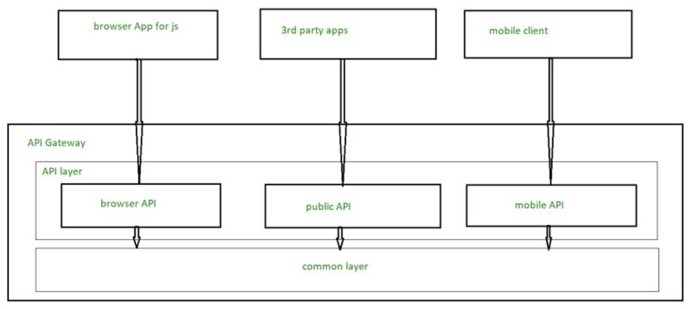
</center>

Uno dei principali vantaggi di questo pattern è che **nasconde la complessità interna dei microservizi**, permettendo loro di evolvere senza impattare le applicazioni client. L’API Gateway riduce anche la **chattiness** tra client e backend, aggregando richieste multiple in una singola risposta e semplificando così la comunicazione. Inoltre, gestisce le **cross-cutting concerns**, ossia funzionalità trasversali come autenticazione, caching, discovery dei servizi, load balancing, rate limiting, circuit breaker, logging, tracciamento e trasformazioni di headers o query string. Centralizzando queste responsabilità, l’API Gateway aumenta la sicurezza e l’efficienza del sistema, e semplifica la manutenzione.

<center>
    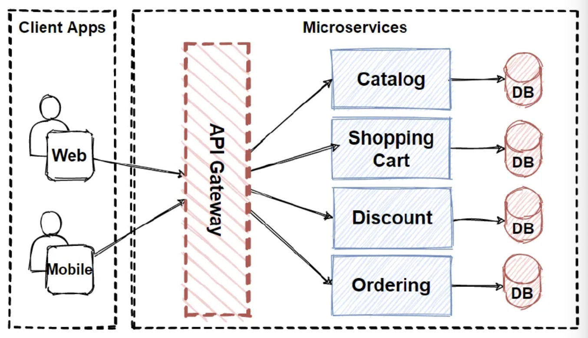
</center>

Dal punto di vista tecnico, l’API Gateway funge da **reverse proxy** e implementa il **gateway routing**, utilizzando tipicamente l’HTTP routing per indirizzare le richieste ai microservizi corretti. Questo approccio **decoupla completamente i client dai servizi interni**, consentendo modifiche o evoluzioni del backend senza dover aggiornare i client. Reverse proxy significa che l’API Gateway riceve le richieste dai client e le inoltra ai server interni, nascondendo la struttura e la complessità del backend.

Un’altra funzionalità chiave è l’**aggregazione delle richieste**, che consente al client di inviare una sola richiesta e ottenere un’unica risposta anche se i dati provengono da più microservizi. In questo modo, le interazioni diventano più efficienti e riducono la complessità lato client.


Nel nostro caso, **l’API Gateway funge da punto centrale attraverso cui tutte le richieste dei client** (frontend web o mobile) arrivano ai microservizi dell’applicazione. Tutte le chiamate verso i servizi di gestione delle **proprietà, stanze, media, utenti e ricerca** passano dal gateway, che si occupa di instradare correttamente ogni richiesta al microservizio corrispondente.

Inoltre, il gateway gestisce le **autenticazioni e autorizzazioni**, quindi solo gli utenti validi possono accedere ai dati o modificare le risorse, e centralizza alcune funzionalità trasversali come la **composizione di dati da più microservizi** (ad esempio quando si visualizzano proprietà con stanze e media collegati), semplificando così il lavoro del client e mantenendo il backend modulare e indipendente.


### **Package Diagram di Design**


<!-- 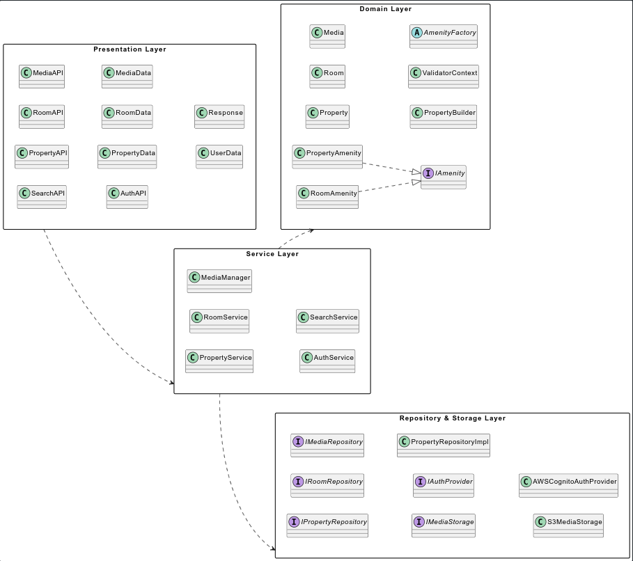 -->


Un **package diagram** è uno strumento UML usato per **raggruppare e organizzare elementi del modello** in insiemi logici (**package**). Serve a **visualizzare le dipendenze ad alto livello** tra i vari pezzi del sistema, riducendo il rumore dei dettagli implementativi.

Quando si parla di **package diagram di analisi**, l'obiettivo è **mappare concetti del dominio e casi d'uso** in grandi raggruppamenti semanticamente coerenti: si scoprono i confini funzionali e si valuta la **coesione** e le **dipendenze** fra parti dell'applicazione, senza dettagliare classi o interfacce concrete.

Il **package diagram di design**, invece, scende un livello più vicino al codice: mostra **come i package analitici vengono realizzati** tramite componenti software, interfacce, implementazioni e sottosistemi. Nel design si definiscono **responsabilità più concrete**, **contratti (interfacce)** e **punti di estensione** (factory, repository, provider esterni).

Separare in package aiuta a ottenere **alta coesione interna** e **basso accoppiamento esterno**: ogni package deve contenere elementi strettamente correlati e offrire **poche API pubbliche** verso l’esterno.
Questo rende più semplice **il testing**, **la sostituzione delle implementazioni** e **la comprensione dell’architettura**.

Nei package di design è importante esplicitare **dipendenze chiare e direzionali** (un package che dipende da un altro non dovrebbe creare dipendenze circolari) e favorire l’uso di **interfacce come contratti**, così da **limitare l’impatto dei cambiamenti tecnologici**.


Nel nostro diagramma abbiamo **cinque grandi package** che riflettono i layer architetturali:
**Presentation Layer (API)**, **DTO Layer**, **Service Layer**, **Domain Layer**, **Repository & Storage Layer**.

L’intento è avere **confini netti**:
le **API** si occupano dell’interazione esterna e della mappatura input/output,
i **DTO** isolano la forma dei dati,
i **Service** gestiscono la logica di business,
il **Domain** contiene le entità e i pattern di dominio (builder, validator, factory),
e le **Repository/Storage** incapsulano persistenza e provider esterni.

**Presentation → DTO → Service → Domain/Repository**.
Questo schema chiarisce che **gli endpoint o le API client-side non accedono mai direttamente al database o allo storage**, ma passano sempre attraverso i Service e i contratti definiti dalle interfacce.


### **Component Diagram**


<!-- 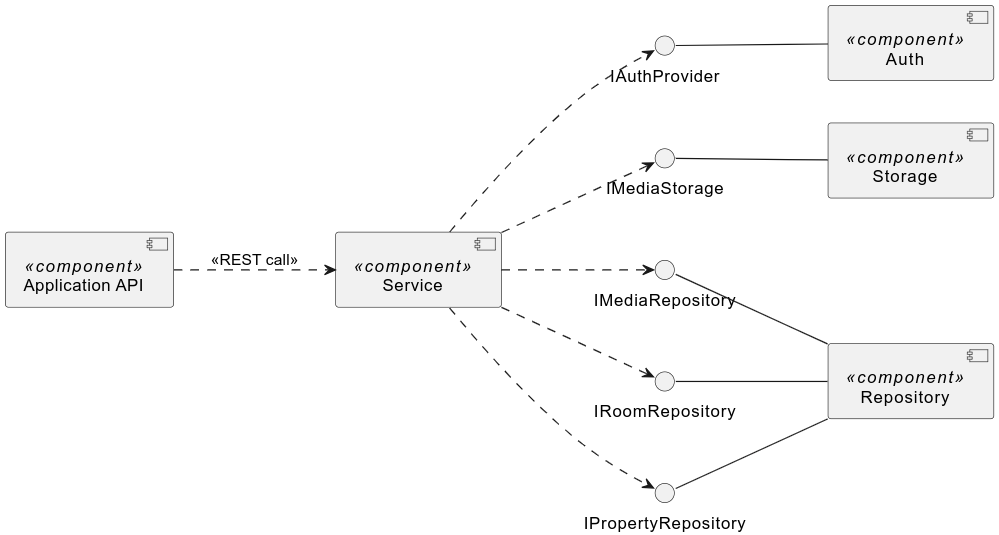 -->

Il diagramma rappresenta l’architettura generale del sistema organizzata in **componenti principali**, con chiara separazione dei livelli. I componenti mostrati sono `Application API`, `Service`, `Repository`, `Storage` e `Auth`, e le interfacce `IPropertyRepository`, `IRoomRepository`, `IMediaRepository`, `IMediaStorage` e `IAuthProvider` definiscono i contratti tra i livelli.

Il componente **`Application API`** racchiude tutte le classi che espongono le funzionalità verso l’esterno, come `PropertyAPI`, `RoomAPI`, `MediaAPI`, `SearchAPI` e `AuthAPI`. Rappresenta quindi il **punto di ingresso del sistema**, sia lato client (come client REST) sia lato server (come endpoint REST). Le frecce tratteggiate che lo collegano a `Service` indicano una **richiesta concettuale di servizio** tramite REST, mostrando il flusso logico delle chiamate senza rappresentare una dipendenza concreta a livello di codice.

Il componente **`Service`** centralizza la logica di business del sistema. Si occupa di orchestrare le operazioni complesse, applicare le regole del dominio, validare i dati e trasformare i DTO in entità del dominio. Le frecce tratteggiate verso le interfacce dei repository e dello storage (`IPropertyRepository`, `IRoomRepository`, `IMediaRepository`, `IMediaStorage` e `IAuthProvider`) indicano che il service **dipende dalle interfacce**, così è facile sostituire le implementazioni concrete senza cambiare la logica di business.

Le interfacce rappresentano i **punti di accesso ai componenti concreti**. I componenti concreti `Repository`, `Storage` e `Auth` forniscono le implementazioni delle interfacce, permettendo al service di usarle senza sapere i dettagli interni. In questo modo il sistema resta flessibile e facile da testare.


- La **separazione dei livelli** tra API, Service e persistenza/storage.
- Le **interfacce come contratti astratti**, utilizzate per ridurre il coupling e aumentare la flessibilità.
- Le frecce tratteggiate tra `Application API` e `Service` e tra `Service` e le interfacce indicano **dipendenze concettuali o richieste di servizio**, mentre le frecce piene verso l’alto mostrano la **realizzazione concreta delle interfacce**.
- `Application API` agisce come contenitore di tutte le classi API, `Service` concentra la logica di business e i componenti concreti gestiscono persistenza e autenticazione.

In questo modo il diagramma comunica chiaramente **come i componenti interagiscono** tra loro, quali dipendenze sono astratte e quali sono implementazioni concrete, mantenendo una visione pulita e adatta alla documentazione UML.


# Progettazione del Database

In questa sezione vediamo la progettazione del database relazionale realizzato per il sistema di onboarding delle proprietà e per la ricerca. Il processo ha seguito le classiche fasi: concettuale, logica e fisica. Come DBMS è stato scelto PostgreSQL su AWS RDS.

## Progettazione Concettuale

L'obiettivo della progettazione concettuale è tradurre i requisiti informativi in una rappresentazione chiara della realtà, indipendente dalla tecnologia. Gli elementi principali sono:

- **Entità e Attributi:** le entità rappresentano classi di oggetti con caratteristiche comuni, descritte tramite *attributi* con un proprio dominio di valori.
- **Chiavi:** tra gli attributi si individuano le *chiavi candidate*, cioè gli insiemi minimi di attributi che identificano univocamente un’istanza. Tra queste si sceglie la *chiave primaria*.
- **Associazioni e Cardinalità:** le connessioni tra entità si chiamano *associazioni* e sono regolate da vincoli di *cardinalità* (min/max), che indicano se la relazione è 1:1, 1:N o N:M.

Il principale strumento in questa fase è il **Diagramma Entità-Relazione (E-R)**, dove rettangoli rappresentano le entità, rombi le associazioni e le linee mostrano cardinalità e gerarchie. Dal diagramma emergono alcune scelte di modellazione:

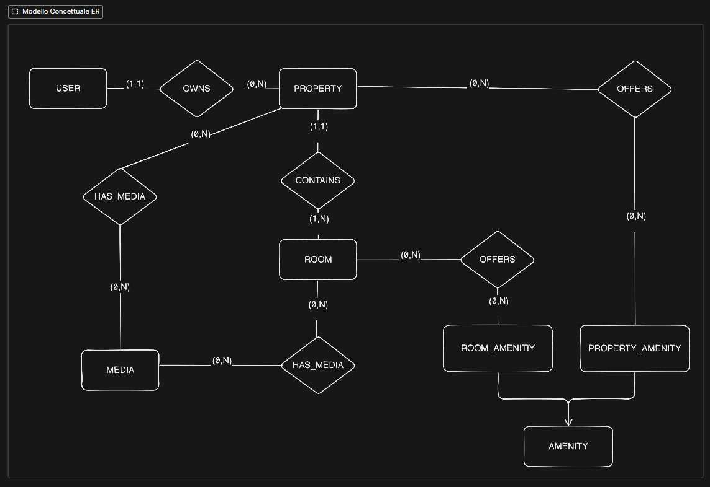  
*Figura: Diagramma Entità-Relazione per il sottosistema di Onboarding delle Proprietà.*

- **Gerarchia Proprietario-Struttura:** l’entità *USER* è collegata a *PROPERTY* tramite *OWNS*. La cardinalità (1,1) lato proprietà significa che ogni struttura deve avere un proprietario, mentre (0,N) lato utente indica che un account può gestire più proprietà o nessuna.

- **Composizione della Proprietà:** *CONTAINS* collega *PROPERTY* a *ROOM*. La cardinalità (1,1) per la stanza indica che non può esistere senza la proprietà, mentre (1,N) per la proprietà indica che deve avere almeno una stanza.

- **Gestione dei Servizi:** le entità *PROPERTY_AMENITY* e *ROOM_AMENITY* sono specializzazioni di *AMENITY*. Così si distinguono i servizi dell’intera struttura (es. Wi-Fi, Piscina) da quelli delle singole stanze (es. Asciugacapelli, Culla), evitando duplicazioni. Entrambe sono collegate tramite relazioni molti-a-molti *OFFERS*.

- **Media:** l’entità *MEDIA* è collegata sia a *PROPERTY* che a *ROOM* tramite *HAS_MEDIA*, così foto e video possono riferirsi alla struttura o alle singole stanze. Ogni media appartiene a una sola entità.

## Progettazione Logica

La **progettazione logica** converte lo schema concettuale in un modello relazionale pronto per il DBMS. Lo schema definisce tabelle, **chiavi primarie**, vincoli e relazioni.

Ogni entità è stata trasformata in tabella, normalizzando gli attributi e usando chiavi artificiali (ID), mentre le chiavi naturali sono vincoli di unicità. Le gerarchie di generalizzazione sono state appiattite secondo i pattern di accesso. Le regole principali per le relazioni:

- N:M → tabelle associative  
- 1:N → chiave esterna nel lato “molti”  
- 1:1 → valutata caso per caso

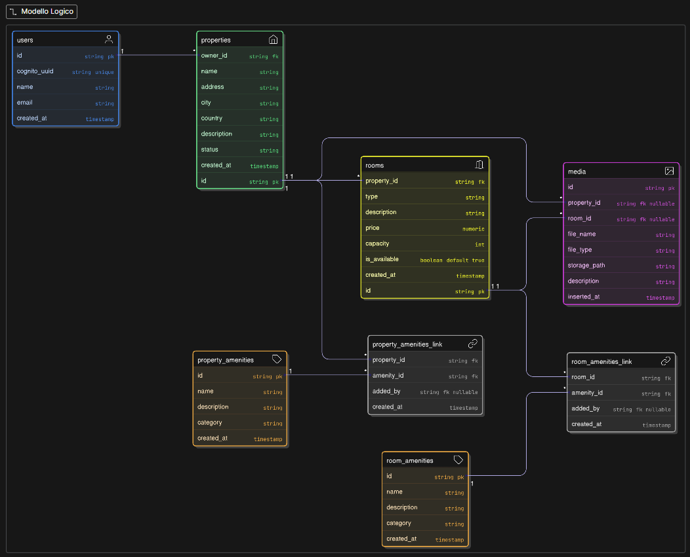  
*Figura: Modello Logico Relazionale del database.*

Trasformazioni principali dal modello E-R a quello logico:

- **Mappatura 1:N:** relazioni gerarchiche come *User-Property* e *Property-Room* diventano chiave esterna nell’entità “debole” (**rooms.property_id**).

- **Risoluzione N:M:** le relazioni *Offers* diventano tabelle associative **property_amenities_link** e **room_amenities_link**, che contengono coppie di chiavi esterne e attributi della relazione (**custom_description**).

- **Gestione della Generalizzazione:** la gerarchia dei servizi è risolta con "Table per Concrete Class", creando **property_amenities** e **room_amenities** separate, semplificando le query.

- **Relazione Esclusiva Media:** *media* ha due colonne nullable **property_id** e **room_id**, con vincolo che può riferirsi solo a una delle due.

## Progettazione Fisica

La progettazione fisica traduce lo schema logico in direttive specifiche per PostgreSQL. Si definiscono tipi fisici (*VARCHAR*, *TIMESTAMP*), vincoli e strutture di accesso (indici).

Lo script *schema.sql* crea tutte le tabelle. Grazie a **ON DELETE CASCADE**, eliminando una proprietà vengono rimosse automaticamente tutte le entità dipendenti, evitando record orfani.

### Strategia di Indicizzazione Semplificata

Per migliorare le prestazioni delle query si è usata una strategia ibrida:

- **Indici B-Tree:** ottimi per ricerche, insert e ordinamenti (O(log n)), applicati su colonne di JOIN e filtri esatti, come tutte le chiavi esterne e **status** in *properties*.  

- **Indici GIN con Trigram:** necessari per ricerche testuali con *ILIKE '%pattern%'*. L’estensione **pg_trgm** divide le stringhe in trigrammi, e l’indice GIN memorizza quali righe contengono quali trigrammi, velocizzando le ricerche su grandi dataset. Applicati su **city** e **name**.

```sql
-- Abilita estensione trigram
CREATE EXTENSION IF NOT EXISTS pg_trgm;
-- Indice trigram su city
CREATE INDEX idx_properties_city_trgm 
   ON properties USING gin (city gin_trgm_ops);
-- Indice trigram su name
CREATE INDEX idx_properties_name_trgm 
   ON properties USING gin (name gin_trgm_ops);
```

Query di ricerca usando B-Tree e GIN:

```sql
SELECT p.id, p.name, p.address, p.city, p.country, p.description
FROM properties p
WHERE p.status = 'PUBLISHED'   -- Usa idx_properties_status (B-Tree)
  AND (p.city ILIKE '%roma%'   -- Usa idx_properties_city_trgm (GIN)
       OR p.name ILIKE '%roma%') -- Usa idx_properties_name_trgm (GIN)
ORDER BY p.created_at DESC
LIMIT 50;
```

Query per recuperare entità correlate:

```sql
-- Recupera stanze (usa idx_rooms_property_id)
SELECT * FROM rooms WHERE property_id = ANY(:hotel_ids);
-- Recupera media (usa idx_media_property_id)
SELECT * FROM media WHERE property_id = ANY(:hotel_ids);
-- Recupera amenities (usa idx_prop_amenities_link_pid)
SELECT * FROM property_amenities_link 
WHERE property_id = ANY(:hotel_ids);

```

Limiti della soluzione: filtri multipli, ricerche geospaziali e ordinamento per rilevanza richiederebbero sistemi più complessi. In produzione sarebbe consigliato un motore dedicato come Elasticsearch o Amazon OpenSearch, con pattern CQRS e sincronizzazione tramite CDC.

Per il progetto si è scelto un approccio semplificato, concentrandosi sull’onboarding e una ricerca base su PostgreSQL.
Seguendo il principio Infrastructure as Code, l’applicazione dello schema è integrata nel provisioning. Con Terraform, una risorsa null_resource esegue lo script schema.sql appena l’istanza database è pronta:

```hcl
resource "null_resource" "db_setup" {
# Riesegue il provisioning solo se cambia lo script SQL
  triggers = {
    schema_hash = filemd5("${path.module}/schema.sql")
  }
  depends_on = [aws_db_instance.postgres] 
  provisioner "local-exec" {
    environment = {
      PGPASSWORD = aws_db_instance.postgres.password 
    }
    # Esegue lo script SQL
    command = "psql -h localhost -U ${aws_db_instance.postgres.username} -d ${aws_db_instance.postgres.db_name} -f ${path.module}/schema.sql"
  }
}
```


### Architettura del Sistema e Cloud Pattern

<center>
    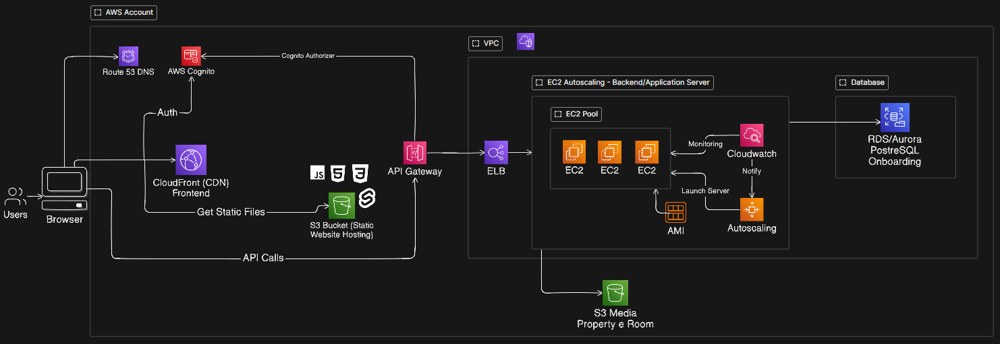
</center>

A conclusione del capitolo di progettazione, viene presentata l’**architettura fisica di riferimento** per il deployment del sistema, evidenziando i componenti coinvolti, i servizi AWS utilizzati e le modalità con cui l’architettura scala in un **ambiente di produzione reale**.

L’architettura disaccoppia nettamente il **livello di presentazione**, la **logica applicativa** e la **persistenza dei dati**, in linea con l’architettura software a strati adottata.


#### Frontend Layer (CDN & Auth)

L’applicazione frontend, sviluppata come **Single Page Application (SPA)** con **SvelteKit**, non è servita da web server tradizionali, ma distribuita globalmente tramite **Amazon CloudFront (CDN)** e ospitata staticamente su **Amazon S3**.  
La scelta di un frontend statico rappresenta un **cloud pattern** che verrà analizzato in seguito.

Il componente di autenticazione non è implementato come logica custom, ma delegato a **AWS Cognito**, che gestisce il ciclo di vita delle identità (**User Pool**), l’emissione dei **token JWT** e la sicurezza degli accessi, fungendo da *Authorizer* per le API.


## Application Layer (Compute & Routing)

Il punto di ingresso del backend è rappresentato da **Amazon API Gateway**, responsabile del routing e della validazione delle richieste.  
La **logica di business** (backend Python) è eseguita su un cluster di istanze **EC2**, gestite tramite un **Auto Scaling Group**, che adatta dinamicamente il numero di nodi in base al carico, e bilanciate tramite un **Load Balancer (ELB)**.


#### Data Layer (Persistence)

La persistenza dei dati strutturati è affidata a **Amazon RDS (PostgreSQL)**.  
I file binari (media, immagini) sono archiviati in un bucket **Amazon S3** configurato con **accesso privato**.

In un’architettura di produzione, l’accesso ai file da parte del client avviene tramite **Presigned URL**: il backend, dotato dei corretti **permessi IAM**, genera URL temporanei e firmati crittograficamente che autorizzano il frontend a caricare o scaricare risorse direttamente da S3, senza esporre credenziali o rendere pubblico il bucket.

Questa architettura garantisce una completa parità tra ambienti:

- **Sviluppo**: utilizzo di **LocalStack** per emulare S3; gli URL generati puntano all’endpoint locale (*localhost*), consentendo il test completo del flusso offline.
- **Produzione**: gli URL puntano all’infrastruttura AWS reale, garantendo accesso limitato nel tempo e solo a utenti autenticati. La soluzione con presigned URL è corretta dal punto di vista della sicurezza, ma priva di cache native; in contesti reali è consigliabile valutare l’introduzione di una **CDN dedicata** anche per i media.


#### Cloud Design Patterns

I **cloud computing patterns** sono soluzioni architetturali riutilizzabili che affrontano problemi ricorrenti nella progettazione di sistemi cloud.  
Essi rappresentano una specializzazione dei pattern architetturali tradizionali, adattata ai requisiti non funzionali tipici del cloud. I pattern possono essere **agnostici** rispetto al provider o **vendor-specific**; in questo lavoro vengono analizzati i principali **AWS Cloud Design Patterns** rilevanti per l’architettura proposta.


##### Web Storage Pattern

Durante lo sviluppo della **demo app** in ambiente locale con **LocalStack**, si è lavorato direttamente con gli **URL S3** generati localmente e puntanti a *localhost*. In questo contesto, tali URL sono stati salvati nel database nell’entità **Media**, esclusivamente per semplificare sviluppo e testing.

In uno **scenario reale di produzione**, questo approccio risulta **sconsigliato**. Gli URL sono dipendenti dall’ambiente e soggetti a variazioni; inoltre, anche utilizzando URL reali di S3, non dovrebbero essere persistiti nel database.  
In produzione è sufficiente salvare **attributi di riferimento logico**, come il **nome del bucket** e la **key S3**. La **key S3** rappresenta l’identificatore univoco dell’oggetto nel bucket e può essere vista come un **percorso logico** associato alla risorsa.

Nel flusso corretto, il frontend richiede al backend i dati associati a un’entità; il backend recupera dal database anche la **key del file** e, previa verifica dei **permessi di accesso** (tramite un **ruolo IAM** con privilegi minimi), genera un **presigned URL temporaneo**.  
L’URL viene restituito al frontend insieme agli altri dati, consentendo la visualizzazione del media e l’utilizzo della **cache del browser**. Poiché i presigned URL hanno una **durata limitata**, in caso di scadenza sarà necessaria una **nuova richiesta** al backend, ad esempio dopo un refresh della pagina.

Il **Web Storage Pattern** affronta il problema della gestione e distribuzione di file di grandi dimensioni, che se serviti direttamente dai server applicativi possono saturare banda e risorse. La soluzione proposta consiste nell’esternalizzare i contenuti statici verso uno storage altamente scalabile come **Amazon S3**, separando la logica applicativa dalla distribuzione dei media.

Nella versione originale del pattern, i file sono considerati **pubblici** e accessibili tramite URL diretti. Nel sistema progettato, invece, i file sono **privati** e l’accesso è mediato dal backend tramite **presigned URL**, garantendo un maggiore livello di sicurezza e controllo, a fronte di un leggero aumento del carico sul backend.


##### Scale Out Pattern

Il **Scale Out Pattern** descrive un approccio per gestire aumenti significativi del traffico superando i limiti dello *scaling up*, che prevede l’aumento delle risorse di un singolo server.  
Lo scaling up è limitato dall’hardware e può risultare inefficiente e costoso.

Il pattern propone di distribuire il carico su più istanze identiche, utilizzando un **Load Balancer**. Servizi come **Elastic Load Balancer**, **CloudWatch** e **Auto Scaling** permettono di aumentare o ridurre automaticamente il numero di istanze in base al carico, garantendo continuità del servizio e ottimizzazione dei costi, pur richiedendo un’attenta configurazione delle regole di autoscaling.


##### Direct Hosting Pattern

Il **Direct Hosting Pattern** affronta il problema della scalabilità nella distribuzione di contenuti statici. In questo pattern, lo storage cloud (ad esempio **Amazon S3**) viene utilizzato per ospitare non solo media, ma anche **HTML, CSS e JavaScript**.

Poiché lo storage Internet è progettato per essere altamente disponibile e scalabile, i contenuti statici vengono caricati in un bucket configurato per l’hosting statico, riducendo drasticamente il carico sui server applicativi. Questo approccio non è adatto a contenuti dinamici lato server, ma risulta ideale per frontend e applicazioni web statiche.

Nel contesto del progetto, il Direct Hosting Pattern è stato applicato all’intero frontend. L’applicazione **SvelteKit** è stata configurata per la **compilazione statica** (*adapter-static*), trasformando l’interfaccia in file statici che non richiedono elaborazione lato server.

Sebbene SvelteKit supporti il **Server-Side Rendering (SSR)**, l’adozione di SSR avrebbe introdotto complessità infrastrutturali non giustificate dai requisiti, come la gestione di server Node.js, autoscaling dedicato e una maggiore **superficie di attacco**.  

Di conseguenza, è stata scelta una strategia di **Static Export (Client-Side Rendering)**.

La catena di distribuzione finale è composta da:

- **Amazon S3 (Storage)**: ospita i file statici come *Origin*, con bucket privato.
- **Amazon CloudFront (Distribution & Caching)**: CDN che fornisce caching globale, riduce la latenza, gestisce SSL/TLS e supporta il routing tipico delle SPA.
- **Amazon Route 53 (DNS Management)**: gestisce la risoluzione dei nomi di dominio tramite record *Alias* verso CloudFront, garantendo alta disponibilità e scalabilità.

In questo pattern, il lavoro di rendering e gestione dello stato viene spostato dal server al browser.  
L’infrastruttura backend non deve più **elaborare** richieste di rendering, ma solo **distribuire** file, consentendo di sostituire server di calcolo con servizi gestiti come S3 e CloudFront. Il trade-off accettato è la rinuncia al pre-rendering dinamico, in cambio di un’infrastruttura **serverless**, altamente scalabile e con costi di gestione minimi.


https://en.clouddesignpattern.org/index.php/CDP_Web_Storage_Pattern.html

https://en.clouddesignpattern.org/index.php/CDP_Direct_Hosting_Pattern.html

https://en.clouddesignpattern.org/index.php/CDP_Scale_Out_Pattern.html

### **IaC LocalStack (Community version)**

Vediamo cosa, della nostra architettura cloud basata su AWS, è possibile emulare con LocalStack Community Edition (gratuita) e cosa invece richiede la versione Pro (a pagamento).

### Confronto LocalStack: Community vs Pro (Student)

| Servizio | LocalStack Community (Gratis) | LocalStack Pro (Student/License) | Cosa succede con Terraform? |
| :--- | :--- | :--- | :--- |
| **EC2** | 🟠 **Finta (Mock)** | ✅ **Reale (Emulato)** | **Comm:** Terraform dice "Creato", ma **non esiste nessun server**. Non puoi collegarti o lanciare comandi. <br>**Pro:** Avvia un vero container che si comporta come un server. |
| **ELB / ALB** | 🟠 **Instabile / Mock** | 🟠 **Reale (Emulato)** | Il Load Balancer sembra attivo ("Healthy"), ma **non passa il traffico** alle istanze. |
| **RDS (Database)** | 🟠 **Finta (Mock)** | ✅ **Reale (Emulato)** | **Comm:** Terraform dice "DB Pronto", ma **non c'è nessun database** a cui connettersi. <br>**Pro:** Avvia un vero database (MySQL/Postgres) utilizzabile. |
| **CloudFront** | 🟠 **Finta (Mock)** | ✅ **Reale (Emulato)** | **Comm:** Accetta la configurazione ma **non funziona**. <br>**Pro:** Distribuisce davvero i contenuti come una CDN. |
| **Cognito** | ✅ **Reale (Base)** | ✅ **Reale (Completo)** | **Comm:** Login e registrazione utenti funzionano. <br>**Pro:** Serve per funzioni complesse (es. collegare Facebook/Google o trigger avanzati). |
| **API Gateway** | ✅ **Reale** | ✅ **Reale** | Funziona in entrambe le versioni per creare API REST e collegarle alle Lambda. |
| **Lambda** | ✅ **Reale** | ✅ **Reale** | Funziona in entrambe. La Pro aggiunge strumenti migliori per il debug (trovare errori). |
| **S3** | ✅ **Reale** | ✅ **Reale** | Caricamento e scaricamento file funzionano perfettamente in entrambe. |
| **Route53** | ✅ **Reale (Base)** | ✅ **Reale (Avanzato)** | **Comm:** Gestisce i nomi DNS semplici. <br>**Pro:** Serve per reti complesse o ibride. |

#### Legenda
- ✅ **Reale (Emulato):** Il servizio funziona davvero. Se crei un server o un DB, questo si avvia e puoi usarlo.
- 🟠 **Finta (Mock):** LocalStack dice a Terraform "Tutto OK" solo per non far fallire lo script, ma **non crea nulla di funzionante**. È solo un guscio vuoto.


**EC2 (Elastic Compute Cloud)** - Le API EC2 sono disponibili in Community ma tutto è completamente mockato. La documentazione è esplicita: "Mock VM Manager - all resources are stored as in-memory representation. This only offers the CRUD capability. This is the default VM manager in LocalStack Community edition." Con Terraform è possibile creare `aws_instance`, `aws_security_group`, `aws_key_pair` e si riceveranno instance IDs validi. Le API rispondono correttamente. Ma c'è zero esecuzione reale: nessuna VM, nessun container, nessun SSH, nessun user data execution. Le istanze sono solo record JSON in memoria. Per un'architettura applicativa le EC2 risulteranno completamente inutilizzabili.

**CloudWatch** - CloudWatch Logs è disponibile in Community con funzionalità base. È possibile creare log groups e streams, scrivere log entries. Le Lambda creano automaticamente log groups. Con Terraform si possono usare `aws_cloudwatch_log_group` e `aws_cloudwatch_log_stream` che funzioneranno. Tuttavia guardando l'API Coverage, molte operazioni avanzate sono Pro. Metric alarms base funzionano ma con limitazioni (no anomaly detection, no metric streams). CloudWatch può essere utilizzato per logging base ma non per monitoring avanzato.

**Autoscaling** - La documentazione dichiara esplicitamente "LocalStack does not support the docker/libvirt VM manager for EC2. It only works with the mock VM manager." E nella API Coverage si trovano operazioni marcate Pro. Nella Community è possibile creare `aws_autoscaling_group` con Terraform e la risorsa verrà accettata, ma risulta completamente non funzionale. Siccome EC2 è mock, l'autoscaling aggiunge o rimuove solo record mock senza alcun comportamento reale. Non c'è scaling funzionante in Community, solo definizioni IaC che non eseguono nulla.

**API Gateway** - LocalStack Community supporta solo REST API (V1) completamente. La documentazione è chiara: "LocalStack supports API Gateway V1 (REST API) in the Free plan, and API Gateway V2 (HTTP, Management and WebSocket API) in the Base plan." Con Terraform è possibile creare `aws_api_gateway_rest_api`, risorse, metodi, integrazioni e deployment. Le REST API create sono realmente invocabili e funzionanti. Le integrazioni Lambda AWS_PROXY funzionano. Ma se l'architettura usa HTTP API (V2) o WebSocket, queste sono Pro e non funzioneranno. È necessario verificare quale tipo di API Gateway viene utilizzato: se è REST API funziona, altrimenti no.

**S3 (Simple Storage Service)** - S3 è completamente supportato in Community Edition. Tutte le operazioni principali nell'API Coverage sono disponibili senza badge Pro. È possibile creare bucket, caricare oggetti, configurare CORS, versioning, lifecycle policies. Con Terraform `aws_s3_bucket`, `aws_s3_object`, `aws_s3_bucket_policy` funzionano perfettamente. Lo storage è reale su filesystem locale. È possibile accedere ai file via HTTP. S3 è uno dei pochi servizPi pienamente funzionali in Community e può essere utilizzato senza limitazioni per storage di media properties e altri file statici.


**NOTA**: esistono due immagini/emulatori per localstack, che sono localstack community (free) e localstack-pro che richiede una licenza (a pagamento) o licenza studenti (a novembre localstack ha chiuso una partnership con github education per offrire localstack-pro gratuitamente agli studenti iscritti a github education). La versione pro offre molti più servizi aws **emulati** e con funzionalità complete rispetto alla versione community gratuita.

Per utilizzare localstack-pro, è richiesto un **auth-token** che si ottiene una volta ottenuta la licenza. L'auth-token va inserito come variabile d'ambiente `LOCALSTACK_AUTH_TOKEN` prima di avviare localstack-pro (o passato in environment variables nel file docker-compose.yml da file .env).

#### Persistence in Localstack

PERSISTENCE=1 in docker-compose.yml permette di salvare i dati in un volume. In questo modo, anche se si ferma e riavvia localstack, i dati (es. bucket S3, oggetti, configurazioni) rimangono intatti (include anche le risorse create via Terraform). 

**NOTA**: la persistenza non riguarda i container con le ec2, se si spegne docker e si riavvia localstack, con la persistenza si salva solo lo state della ec2 (LocalStack ricarica solo i record EC2 (ID istanza, stato, metadati) dai file di stato), ma è fake perchè i container non ripartono.

**Please note that this VM manager does not fully support persistence. While the records of resources will be persisted, the instances or AMIs themselves (i.e. Docker containers and Docker images) will not be persisted.**

#### Localstack EC2

In LocalStack Pro, EC2 APIs utilize the Docker Engine backend to emulate EC2 instances. When you launch an EC2 instance locally, LocalStack sets up a Docker container recognized as an Amazon Machine Image (AMI). This enables users to log in to the instance, test their configurations, and conduct end-to-end integration tests on a local EC2 infrastructure.

In LocalStack, networking features like subnets and VPCs are not emulated. LocalStack provides a default security group that manages the exposed ports for the EC2 instance. While users can create additional security groups, LocalStack focuses on the default security group.

In questo ambiente di emulazione (anche versione pro), le primitive di rete quali VPC, Subnet e Route Tables rappresentano pure astrazioni logiche memorizzate nel database interno dell'applicazione (spesso gestito dalla libreria Moto), ma non corrispondono a una reale segmentazione della rete a livello infrastrutturale. Tutti i container lanciati, indipendentemente dal VPC di appartenenza dichiarato in Terraform, risiedono fisicamente sulla medesima rete "bridge" di Docker. Poiché l'isolamento di rete non è realmente emulato, il software necessita di un criterio deterministico per decidere quali porte del container debbano essere esposte sull'interfaccia di loopback (localhost) della macchina ospitante.

Per semplificare l'esperienza di sviluppo, tale criterio è stato programmaticamente vincolato al Security Group di default. Quando LocalStack rileva una regola di ingresso (Ingress Rule) su questo specifico gruppo, interpreta tale configurazione come un'istruzione operativa da trasmettere al demone Docker, eseguendo effettivamente il port binding (il comando -p host_port:container_port).

Al contrario, i Security Group personalizzati (Custom Security Groups) vengono trattati esclusivamente come metadati API. Sebbene Terraform registri correttamente le regole di firewall nel database di LocalStack permettendo il traffico tra container interni (ad esempio tra Load Balancer ed EC2), il sistema non traduce queste regole in comandi di esposizione verso l'host esterno.

morale della favola per testare ec2 bisogna usare vpc, subnet e security group di default (non custom) in modo che localstack possa esporre le porte delle ec2 sull'host macos/linux.


##### Problema Docker Desktop on MacOs

Su macOS Docker Desktop non usa il kernel del sistema operativo per eseguire i container. Il problema nasce dal fatto che macOS non supporta nativamente le funzionalità richieste da Docker, come i namespace, i cgroups e soprattutto la gestione delle reti Linux, compresa la docker bridge network. Per compensare questa mancanza Docker crea una piccola macchina virtuale Linux tramite HyperKit o ora tramite Apple Virtualization Framework, e tutti i container girano dentro quella VM. Il risultato è che l’intero networking dei container vive all’interno di quella macchina virtuale e non è direttamente raggiungibile dal Mac.

Quando un container crea un’interfaccia di rete bridge, come la classica docker0, questa esiste soltanto dentro la VM e non appare in macOS. Di conseguenza l’host non può raggiungere gli indirizzi interni dei container (per esempio 172.17.0.2), non può sniffare il traffico della rete bridge, non può usare ARP o routing diretto verso i container e non può collegarsi alla rete interna come farebbe normalmente su Linux. Per comunicare con i container si è costretti a usare il port forwarding che Docker Desktop configura automaticamente, ma non si può accedere alla rete interna vera e propria. Questo è il motivo per cui servizi che simulano macchine virtuali, come EC2 su LocalStack, non possono essere raggiunti tramite il loro IP interno: quel traffico resta confinato nella VM.

Linux invece esegue Docker direttamente sul kernel dell’host, senza una VM intermedia. La rete bridge di Docker è creata come una normale interfaccia di rete, visibile dal sistema operativo e completamente integrata nello stack di rete del kernel. L’host può raggiungere direttamente i container tramite il loro indirizzo IP interno, può unirsi alla bridge network, può creare route personalizzate e può ispezionare pacchetti e interfacce come se fossero parte del sistema. L’assenza di virtualizzazione elimina ogni barriera tra host e container: lo spazio dei processi, del filesystem e della rete vive nello stesso kernel e questo rende possibile fare cose che su macOS sono tecnicamente precluse, come accedere nativamente agli indirizzi della rete Docker o collegare servizi host alla rete interna dei container senza passare da un port mapping.

In breve, su macOS la rete Docker è nascosta dentro una VM e l’host non può entrarci, mentre su Linux la rete Docker è parte del sistema operativo e quindi totalmente accessibile.

Nel nostro caso con le ec2 di localstack lanciate in container docker, su macos non possiamo raggiungere le ec2 tramite il loro ip interno perchè la rete docker è dentro la VM di docker desktop e non è raggiungibile dal macos host. Su linux invece possiamo raggiungere le ec2 tramite il loro ip interno perchè la rete docker è parte del sistema operativo linux host. Possiamo comunque raggiungere le ec2 tramite il port mapping configurato da localstack (es. porta 22 per ssh oppure porta 8000 per un servizio), ovviamente sia per macos che per linux (vedi tutorial https://hashnode.localstack.cloud/running-an-ec2-instance-locally-using-localstack-and-aws-cli)


1. capitolo introduttivo in cui speghiamo cosa vogliamo fare e obiettivi. iac e cloud
2. stato dell arte. cosa abbiamo usato spiegazione. terraform ansible ecc, tutte le tecnologie. anche localstack.
3. cap metodologie. trovato libro con app. spieghiamo la nostra arch e pattern e come useremo localstack. progettazione database. tutto uml.
4. implementazione. facciamo anche vedere un po di codice tf, docker compose. solo cose fondamentali.
5. risultati. descriviamo l'app funzionante
6. conclusioni. cosa ho imparato dalla tesi, limitiazioni, cosa si puo migliorare. 

finire flow principale demo app

prova ansible ec2, carico app in ec2 con ansible. magari lo menzionaimo come sviluppo futuro.
kubernetes al massimo menzioniamo solo ma non lo usiamo.
design uml non per forza da scrivere preciso nelle due app.

