# Progetto Applicazione Cloud: Designing a Hotel Reservation System (AWS)

Il progetto riguarda progettazione di un Hotel Reservation System distribuito su infrastruttura cloud AWS, con l’obiettivo di realizzare un sistema scalabile, affidabile e sicuro per la gestione delle prenotazioni alberghiere online.
Il sistema si ispira a piattaforme consolidate come Booking.com o Airbnb, permettendo agli utenti di cercare e prenotare alloggi in base alla località, al periodo di soggiorno e alle preferenze personali, e ai proprietari di strutture di gestire in autonomia le proprie proprietà.

Poichè il sistema complessivo è complesso, esso si può suddividere in più sottosistemi principali che si occupano di specifiche funzionalità, ed ognuno di questi utilizza servizi AWS differenti per ottimizzare le prestazioni e la scalabilità.

Inizieremo considerando solo la progettazione di uno di questi sottosistemi (sistema di onboarding), semplificando eventualmente alcune funzionalità dei rimanenti.

## **Analisi dei Requisiti di Sistema**

Il requisito più importante è: permettere ai clienti di prenotare una stanza per i loro soggiorni futuri. Più nel dettaglio, il sistema deve occuparsi di: 

- **Onboarding delle proprietà:**  
  Il sistema deve permettere di inserire una singola catena alberghiera o qualsiasi altra proprietà nel sistema per elencare le stanze. Le proprietà possono aggiungere le stanze con i relativi servizi/amenities (ad esempio, colazione inclusa, animali ammessi, ecc.) e i prezzi.

- **Ricerca delle stanze:**
    Gli utenti devono poter cercare le stanze disponibili in base a vari criteri, come località, date di soggiorno, numero di ospiti e preferenze specifiche (ad esempio, tipo di stanza, servizi inclusi).

- **Prenotazione delle stanze (NON LO CONSIDEREREMO IN PROGETTAZIONE E IMPLEMENTAZIONE):**
    Una volta trovata una stanza adatta, gli utenti devono poter effettuare la prenotazione, specificando le date di arrivo e partenza, il numero di ospiti e altre informazioni necessarie.

    - **Gestione dei pagamenti:**  
        Bisogna decidere chi riceverà i pagamenti dagli utenti. Il sistema accetta i pagamenti per conto dei proprietari, oppure gli utenti pagano direttamente alla proprietà?  
        Se gli utenti pagano direttamente, il sistema non deve gestire il ciclo dei pagamenti, ma questo può ridurre l’esperienza dei proprietari: i clienti possono prenotare e non presentarsi. Per soddisfare sia gli utenti che i proprietari, il sistema lascia ai proprietari decidere il metodo di pagamento e altre policy specifiche della proprietà.
        **Per semplicità, almeno inizialmente, si può simulare il pagamento senza implementare un vero sistema di pagamento.**

Altre funzionalità implementabili, ma di cui **non ci occuperemo almeno inizialmente** sono:
- gestione reale dei pagamenti; si può simulare il pagamento senza implementare un vero sistema di pagamento;
- doppi booking e gestione dei conflitti;
- prezzi dinamici basati su ML;
- raccomandazioni su attrazioni locali.
- recensioni e valutazioni degli utenti;

### **Requisiti Funzionali**

**Il sistema ha due tipi di utenti**: property owners (proprietari delle strutture) e customers(utenti che prenotano le stanze per un determinato periodo).

**Requisiti funzionali per i property owners:**
- Onboarding nel sistema con dettagli personali, informazioni per il pagamento e altri dati necessari.
- Inserire una o più proprietà con dettagli come numero e tipologia delle stanze, struttura dei prezzi, immagini della proprietà e eventuali servizi aggiuntivi.
- Aggiornare i dettagli delle proprietà, come numero di stanze disponibili, prezzi e immagini.
- Visualizzare lo stato delle prenotazioni correnti e passate, le recensioni degli utenti, i guadagni e altre informazioni correlate.
- **In sostanza si richiede che gli owner possano fare CRUD sulle property.**

**Requisiti funzionali per i customers:**
- Ricercare proprietà in una determinata zona geografica, selezionando intervalli di date per check-in e check-out.
- Applicare filtri aggiuntivi alla ricerca, come valutazione della proprietà (ad esempio 4 o 5 stelle), permesso di animali, politiche di cancellazione, inclusione della colazione. Quindi si riferisce alla necessità di eseguire query complesse.
- Prenotare una stanza e pagare (se previsto dalla politica della proprietà) oppure pagare direttamente alla proprietà con un deposito minimo.
- Aggiornare la prenotazione, ad esempio modificando date, aggiungendo stanze, cambiando orari di check-in/check-out, effettuando pagamenti aggiuntivi o prenotando servizi extra come spa o room service.
- Visualizzare le prenotazioni correnti e passate.
- Cancellare la prenotazione, con gestione dei pagamenti e rimborsi in base alla politica della proprietà. Se abbiamo un sistema di pagamento simulato, possiamo semplicemente aggiornare lo stato della prenotazione senza gestire effettivamente i rimborsi.

**Quindi per i customers ci aspettiamo la possibilità di fare CRUD sulle prenotazioni, oltre a query complesse per la ricerca delle stanze**.

La gestione delle query complesse per le ricerche richiederebbe l'uso di un motore di ricerca dedicato come Elasticsearch, ma per semplicità potremmo implementare una soluzione basata su database relazionali o NoSQL con indici adeguati.

### **Requisiti Non Funzionali**
- **Alta disponibilità e affidabilità:** il sistema deve essere sempre disponibile e stabile.
- **Consistenza forte:** lo stato di prenotazioni e pagamenti deve essere coerente su tutti i sistemi di prenotazione.
- **Bassa latenza nelle ricerche:** il sistema di ricerca deve mostrare rapidamente la lista delle proprietà.
- **Tolleranza ai guasti:** il sistema deve prevenire principalmente doppie prenotazioni o pagamenti e gestirle in modo appropriato se si verificano.

Questi sono i requisiti non funzionali complessivi per tutto il sistema, nel nostro caso se ci occupiamo solo del sottosistema di onboarding, possiamo considerare come requisiti non funzionali principalmente:
- alta disponibilità e affidabilità;
- scalabilità del sistema di onboarding per gestire un numero crescente di proprietari e proprietà; 
- sicurezza: solo utenti autenticati e autorizzati possono accedere al sistema di onboarding e gestire le proprie proprietà. **Quindi sicuramente và implementato un sistema di autenticazione e autorizzazione; per esempio utilizzando AWS Cognito come servizio AWS.**

### **Scalabilità Complessiva del Sistema**

Come per i requisiti funzionali, la scala del sistema può essere divisa in due parti: il **numero di proprietà** elencate e il **numero di utenti** che cercano e prenotano le proprietà.  

> Nota: i numeri riportati sono **assunzioni** basate su stime e non su dati concreti. È consigliabile partire dal proprio caso d’uso per definire i numeri iniziali e poi pianificare la scalabilità.

#### Assunzioni di base
- Numero di proprietà: 10 milioni in tutto il mondo
- Numero medio di proprietà per località: 500
- Numero medio di stanze per proprietà: 100
- Totale stanze nel mondo: 10 milioni × 100 = 1 miliardo
- Soggiorno medio per proprietà: 2 giorni

#### Scala delle ricerche e prenotazioni

- **Tasso di ricerca:** 20 milioni/giorno = 250 richieste/secondo
- **Utenti attivi sulla piattaforma:** 100 milioni
- **Prenotazioni effettive:** 10% delle ricerche = 2 milioni/giorno = 25 richieste/secondo

#### Requisiti di storage approssimativi

Il sistema mantiene informazioni su **utenti**, **proprietà** e **prenotazioni**.

- **Dettagli stanza:** {room ID, tipo, servizi, prezzo minimo, prezzo massimo, dimensioni} = 500 bytes
- **Dettagli proprietà:** {property ID, indirizzo, numero stanze, servizi} = 500 bytes

**Totale storage per proprietà:**  
500 bytes + 100 × 500 bytes = 50 KB  

**Storage totale per tutte le proprietà:**  
10 milioni × 50 KB ≈ 500 GB  

**Storage media proprietà (immagini e video):**  
10 immagini per proprietà × 1 KB ciascuna = 10 KB  
10 milioni di proprietà × 10 KB ≈ 100 GB  

> Lo storage per media è relativamente basso perché le proprietà vengono aggiunte meno frequentemente rispetto alle prenotazioni giornaliere.

**Storage prenotazioni:**  
- Storage per una prenotazione {dati ospite, dettagli prenotazione, importo totale} = 1 KB  
- Storage totale = 1 KB × 2 milioni = 2 GB/giorno ≈ 730 GB/anno

### **Scalabilità Sottosistema Onboarding**

Il sottosistema di Onboarding delle Proprietà rappresenta la componente del sistema dedicata alla registrazione e gestione dei dati delle strutture ricettive da parte dei proprietari.
A differenza dei moduli di ricerca e prenotazione, il carico di lavoro in questo caso è più contenuto e irregolare, poiché dipende dalle operazioni di inserimento, aggiornamento e manutenzione dei dati delle proprietà, eseguite solo dai property owners.

## **High-Level System Design**

Il sistema complessivo può essere suddiviso in tre parti principali:

1. **Onboarding delle proprietà**  
2. **Ricerca delle proprietà**  
3. **Prenotazione di una proprietà**

    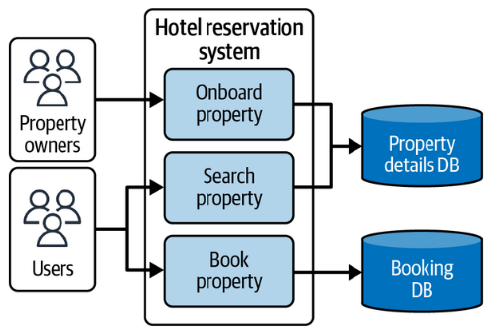

Ogni parte può essere ulteriormente suddivisa in sottosistemi più piccoli che si occupano di specifiche funzionalità.

Sofferiamoci ora sul primo sottosistema: **Onboarding delle proprietà**.

**RICAPITOLANDO**: questa era una panoramica ad alto livello del sistema anche in parte semplificata rispetto al libro, noi ci occuperemo, a livello di **progettazione** e **implemetnazione** solo del sottosistema di **onboarding delle proprietà** e della parte di ricerca delle proprietà da parte dell'user ma in maniera più semplificata rispetto alla soluzione adottata dal libro. **NON** ci occuperemo della parte di prenotazione delle proprietà (quindi non la modelleremo nè la implementeremo).

### **Property Onboarding Architecture**

Il requisito principale del sistema di **onboarding** è raccogliere i dati dai proprietari e salvarli in modo tale da rendere le ricerche rapide ed efficienti.  
Questo processo può essere visto come un flusso di lavoro a più stati (una sorta di *state machine*), in cui ogni fase gestisce input diversi, come mostrato in Figura.

    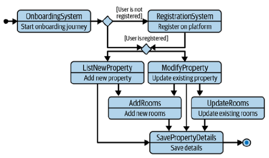

- Il primo stato riguarda la raccolta delle informazioni di base sulla proprietà, come nome, indirizzo, numero di stanze e servizi offerti. In questa fase si richiede che **l'owner sia autenticato** per poter inserire i dati.
- Una volta autenticato, l'owner può decidere se inserire una nuova proprietà o aggiornare una proprietà esistente. (CRUD)
  - Se sceglie di inserire una nuova proprietà, il sistema richiede ulteriori dettagli, come immagini della struttura, descrizione, regole della casa e politiche di cancellazione.
  - Se sceglie di aggiornare una proprietà esistente, il sistema recupera i dati correnti e permette all'owner di modificarli.
- Dopo aver inserito o aggiornato i dettagli della proprietà, il sistema salva le informazioni nel database e conferma l'avvenuta operazione all'owner.

#### **Scelta dell’architettura dati**

Un punto cruciale nella progettazione riguarda la **scelta del database** e del modello dei dati, in quanto le informazioni delle proprietà presentano sia componenti relazionali (relazioni tra proprietà, stanze, indirizzi) sia requisiti di flessibilità e scalabilità orizzontale.

##### **Opzione 1 — RDBMS (es. Amazon Aurora)**

Un modello relazionale è naturalmente adatto quando si gestiscono entità fortemente correlate:  
una *proprietà* appartiene a una *città*, contiene *camere*, e ciascuna camera può avere *servizi associati* (amenities) e *prezzi*.  

Un modello iniziale potrebbe includere tabelle come:

- `property` (dati principali)  
- `property_address`  
- `property_rooms`  
- `property_facilities`  
- `room_types`  

Questa struttura consente di garantire **consistenza ACID** nelle operazioni di onboarding, utile soprattutto quando più utenti aggiornano simultaneamente le informazioni relative a una stessa proprietà.  
L’utilizzo di **Amazon Aurora (PostgreSQL)** permette di mantenere una forte consistenza, con storage distribuito fino a 128 TB e replica automatica in più zone di disponibilità.  

Tuttavia, all’aumentare del volume di dati (milioni di proprietà e centinaia di milioni di stanze), un RDBMS può richiedere **sharding o partizionamento** per mantenere alte le prestazioni.

---

##### **Opzione 2 — DynamoDB (NoSQL, chiave–valore)**

Un’alternativa più scalabile è **Amazon DynamoDB**, che elimina la necessità di join complessi e supporta nativamente la **scalabilità orizzontale**.  
In DynamoDB, i dati sono organizzati in **item** all’interno di **tabelle**, ciascuna identificata da una chiave primaria.  
La chiave può essere:
- **semplice**, composta solo da una *partition key*, oppure  
- **composta**, costituita da una *partition key* e una *sort key*.

La *partition key* determina la distribuzione fisica dei dati, mentre la *sort key* consente di ordinare e raggruppare logicamente gli item correlati.

Nel modello di esempio per le proprietà:
- la **partition key** è `propertyId`, così tutti i dati relativi a una singola proprietà risiedono nella stessa partizione;
- la **sort key** differenzia i vari tipi di informazioni secondo convenzioni di naming, ad esempio:  
  - `PY` → dettagli principali della proprietà  
  - `PY#IMG#{imageId}` → immagini della proprietà  
  - `PY#R#{roomId}` → dati della stanza  
  - `PY#R#{roomType}#IMG#{imageId}` → immagini associate a una specifica stanza  

In questo modo, tramite query basate su `begins_with(sortKey, 'PY#R#')` è possibile recuperare tutte le stanze di una proprietà con una singola operazione di lettura, senza necessità di join.

Inoltre, DynamoDB consente di definire **indici secondari (GSI e LSI)** per supportare query alternative (es. per città, per owner, o per stato di pubblicazione).  
Questa architettura permette di ottenere latenze di lettura inferiori ai 10 ms e un throughput lineare all’aumentare del carico.

Per un sistema iniziale o a scala limitata, **Aurora** può risultare più comodo grazie al modello relazionale e alle garanzie di consistenza.  
Per un sistema su larga scala, con milioni di proprietà e aggiornamenti distribuiti, **DynamoDB** offre maggiore **scalabilità e semplicità operativa**, a costo di una minore flessibilità nelle query complesse.

---

## **Servizi e Architettura per AWS**

Come per la progettazione del sistema, suddivideremo l’architettura in sottosistemi e analizzeremo la **deployment view** dell'architettura del sistema di onboarding.

Concentriamoci solo sull'architettura iniziale del sottosistema di onboarding delle proprietà.

    

Gli utenti interagiscono con il sistema tramite **Amazon Route 53**, che fornisce un dominio unico e risolve le richieste verso **Amazon API Gateway**, il quale espone le API per la creazione e l’aggiornamento delle proprietà e integra l’autenticazione tramite **AWS Cognito**, che è un servizio gestito per l’autenticazione e l’autorizzazione degli utenti.

Il backend è gestito tramite **AWS Lambda**, che contiene la logica di business e interagisce con tre data store principali: una tabella **Amazon DynamoDB** e due bucket **Amazon S3**. DynamoDB memorizza le informazioni sulle proprietà secondo lo schema di onboarding, mentre un bucket S3 conserva i **media content**, come immagini e video delle stanze, e l’altro pubblica tutte le **configurazioni in formato statico**.

NOTA: **per il backend, al posto di avere un backend completamente serverless con aws lambda, potreemo anche utilizzare delle istanze EC2**.

Le configurazioni pubblicate su S3 fungono da **punto di riferimento coerente e stabile** per tutti i sistemi downstream. Ad esempio, il **sistema di ricerca** le legge per costruire indici ottimizzati per query complesse, mentre altri sistemi come pricing o analytics possono leggere gli stessi file JSON senza accedere direttamente a DynamoDB. Questo approccio riduce il coupling tra sistemi, consente versioning naturale dei dati e semplifica la gestione degli errori, poiché ogni snapshot rappresenta uno stato completo e consistente della proprietà, comprensivo di stanze, prezzi, servizi e disponibilità. CW Event in figura si riferisce a un cloudwatch event che si triggera su una put in S3.

L’uso diretto di **DynamoDB Streams** per popolare sistemi di ricerca o pricing è possibile ma sconsigliato. Gli stream inviano solo i delta delle modifiche, costringendo i consumer a ricostruire lo stato completo combinando eventi e record precedenti. Questo aumenta la complessità, la probabilità di incoerenze in caso di errori o fallimenti della Lambda, e crea un forte accoppiamento tra il modello dati di onboarding e i sistemi downstream. Al contrario, pubblicare snapshot statici su S3 permette di modellare i dati secondo le esigenze di ciascun sistema, mantenendo DynamoDB come database di origine ottimizzato per le operazioni CRUD e S3 come **interfaccia contrattuale** affidabile e scalabile.

Quindi ricapitolando: si salvano i dati delle proprietà in DynamoDB per operazioni veloci di CRUD, e poi periodicamente (o su eventi specifici) si generano snapshot completi in formato JSON che vengono salvati in S3. Questi snapshot servono come fonte di verità per altri sistemi che necessitano di leggere i dati delle proprietà, come il sistema di ricerca o di pricing. Per mantenere la consistenza tra DynamoDB e gli snapshot in S3, si può utilizzare una Lambda che si attiva su modifiche a DynamoDB (tramite DynamoDB Streams) o su eventi specifici, generando e salvando gli snapshot aggiornati in S3.

Questa architettura consente di separare chiaramente i ruoli tra backend, storage e sistemi di consumo dei dati, migliorando la coerenza, la resilienza e l’affidabilità complessiva del sistema.

NOTA: **Se si decide di non implementate il motore di ricerca come opensearch, ma di utilizzare un database relazionale o NoSQL per le ricerche, allora non è necessario pubblicare gli snapshot in S3. In questo caso, il sistema di ricerca può leggere direttamente da DynamoDB o dal database relazionale scelto.**

## **Infrastracture as Code e Deployment**

Per il deployment dell'infrastruttura AWS, si può utilizzare **Terraform** come strumento di Infrastructure as Code (IaC). Terraform consente di definire, configurare e gestire le risorse AWS in modo dichiarativo, facilitando il versionamento e la riproducibilità dell'infrastruttura.

### Componenti principali da gestire con Terraform

- **Amazon Cognito**: gestione di User Pool e App Client per l’autenticazione e l’autorizzazione dei proprietari.  
- **Amazon API Gateway**: esposizione delle API per creare, aggiornare e leggere i dati delle proprietà.  
- **AWS Lambda**: funzioni di backend per la logica di business, inclusa la generazione degli snapshot JSON delle proprietà. **In alternativa si possono utilizzare istanze EC2.** sempre tramite terraform.
- **Amazon DynamoDB**: tabella principale per memorizzare i dati delle proprietà, con chiave primaria e indici secondari.  
- **Amazon S3**:  
  - bucket per il **media content** (immagini e video delle proprietà e delle stanze);  
  - bucket per **configurazioni statiche**, snapshot JSON delle proprietà utilizzabili dagli altri sistemi.  
- **Amazon Route 53**: gestione del dominio e instradamento del traffico verso le API.  

## **Utilizzo di LocalStack per lo Sviluppo Locale**

Per facilitare lo sviluppo e il testing dell’infrastruttura AWS senza dover utilizzare risorse reali in cloud, è possibile integrare LocalStack nel flusso di lavoro. LocalStack fornisce un ambiente locale che emula i principali servizi AWS, come DynamoDB, S3, Lambda, API Gateway e Cognito, permettendo di testare le risorse in locale in modo rapido e sicuro.

La configurazione di LocalStack può essere gestita tramite Docker Compose, definendo i servizi necessari per l’emulazione. Inoltre, Terraform può essere configurato per puntare a LocalStack durante lo sviluppo locale, consentendo di creare e gestire le risorse AWS simulate.

    

## **Progettazione UML**

### **Use Case Diagram**
Cominciamo da un diagramma dei casi d'uso (use case diagram) per il sottosistema di onboarding delle proprietà.

<!--  -->

Il diagramma dei casi d’uso rappresenta le funzionalità principali del sottosistema di **onboarding delle proprietà** e della **ricerca delle proprietà**, mettendo in evidenza i diversi tipi di utenti e i permessi associati a ciascuno.

Partiamo dagli **attori**. Abbiamo l’attore generico **User**, che rappresenta qualsiasi visitatore del sistema, sia autenticato sia non autenticato. Da **User** derivano due specializzazioni: **Customer** e **Property Owner**.  

- Il **Customer** è l’utente finale che naviga il sito, cerca le proprietà e, eventualmente, in futuro potrà prenotare. Per il momento, nel diagramma, **la prenotazione non è modellata**.  
- Il **Property Owner** è chi possiede e gestisce le strutture ricettive: può registrarsi, accedere al sistema e gestire le proprie proprietà.

Quando un utente si autentica, entra in gioco l’attore **Authenticated User**. Questo attore rappresenta **tutti gli utenti loggati**, sia Customer sia Owner.  
In pratica:  
- se un **Property Owner** è autenticato, può accedere alle funzionalità di onboarding e gestione delle proprietà;  
- se un **Customer** è autenticato, potrà in futuro prenotare, ma oggi può solo **cercare proprietà** come un utente generico.

Il diagramma è suddiviso in **pacchetti funzionali** per rendere più chiara la visione delle responsabilità:

1. **Authentication**  
   Qui sono raccolti i casi d’uso relativi a registrazione e login. Un utente può **registrarsi**, effettuare il **login** o il **logout**. La registrazione include obbligatoriamente l’**inserimento dei dati personali**, indicato con `<<include>>`, perché è parte integrante del processo.

2. **Property Management**  
   In questo pacchetto si concentrano tutte le operazioni disponibili per i **Property Owner autenticati**.  
   Possono:  
   - **Visualizzare l’elenco delle proprie proprietà**  
   - **Creare nuove proprietà**  
   - **Aggiornare proprietà esistenti**  

   La **creazione** o l’**aggiornamento** include sempre la **gestione delle stanze**, mentre il **caricamento dei media** (immagini, video) è opzionale, modellato come `<<extend>>`.  
   Durante l’aggiornamento, è possibile anche **eliminare la proprietà**, ma questo è considerato un caso estendibile, non obbligatorio.  
   La **gestione delle stanze**, a sua volta, include la possibilità di **aggiungere, modificare o eliminare singole stanze**.

3. **Property Search**  
   Questo pacchetto raccoglie le funzionalità di ricerca, **accessibili a tutti gli utenti**, sia anonimi sia autenticati.  
   La ricerca include sempre la possibilità di **visualizzare i dettagli della proprietà**, mentre l’**applicazione di filtri** è opzionale (`<<extend>>`).  

In questo modo, il diagramma mostra chiaramente:  
- la **separazione dei ruoli e dei privilegi**;  
- quali operazioni sono **obbligatorie** e quali sono **opzionali**;  
- come i diversi casi d’uso si collegano tra loro tramite `<<include>>` e `<<extend>>`.

#### **Descrizione degli Scenari Principali**

##### **Autenticazione Utenti**

| Nome caso d’uso                     | SignUp                                                                                                                                                 |
| ----------------------------------- | -------------------------------------------------------------------------------------------------------------------------------------------------------- |
| **Descrizione**                     | Permette a un nuovo utente di creare un account nel sistema, inserendo i propri dati personali.                                                          |
| **Attori**                          | User, Property Owner, Customer                                                                                                                                     |
| **Precondizioni**                   | L’utente non deve avere un account esistente.                                                                                                            |
| **Postcondizioni**                  | L’utente è registrato e può effettuare il login.                                                                                                         |
| **Flusso principale degli eventi**  | 1. L’utente seleziona l’opzione di registrazione. 2. Inserisce i dati personali richiesti. 3. Il sistema salva i dati e conferma la registrazione. |
| **Flusso alternativo degli eventi** | 2a. Dati mancanti o non validi: il sistema richiede correzione. 2b. L’utente annulla la registrazione: nessun dato viene salvato.                     |
| **Requisiti speciali**              | Validazione dei dati, gestione errori, sicurezza dei dati personali.                                                                                     |

---

| Nome caso d’uso                     | Enter Personal Data                                                                                                                                                                                         |
| ----------------------------------- | ----------------------------------------------------------------------------------------------------------------------------------------------------------------------------------------------------------- |
| **Descrizione**                     | Permette a un nuovo utente di inserire le informazioni personali richieste per completare la registrazione.                                                                                                 |
| **Attori**                          | User, Property Owner, Customer                                                                                                                                       |
| **Precondizioni**                   | L’utente deve aver avviato la registrazione.                                                                                                                                                                |
| **Postcondizioni**                  | I dati personali sono salvati nel sistema e l’utente può completare la registrazione.                                                                                                                       |
| **Flusso principale degli eventi**  | 1. L’utente seleziona l’opzione per inserire dati personali. 2. L’utente compila il modulo con nome, cognome, email, password e altre informazioni richieste. 3. Il sistema valida i dati e li salva. |
| **Flusso alternativo degli eventi** | 2a. Dati incompleti o non validi: il sistema mostra un messaggio di errore e richiede la correzione. 2b. L’utente annulla l’inserimento: nessun dato viene salvato.                                      |
| **Requisiti speciali**              | Validazione dei dati, gestione sicura delle informazioni.                                                                                                                                  |

---

| Nome caso d’uso                     | Login                                                                                                                                                       |
| ----------------------------------- | ----------------------------------------------------------------------------------------------------------------------------------------------------------- |
| **Descrizione**                     | Permette a un utente registrato di autenticarsi nel sistema.                                                                                                |
| **Attori**                          | User, Property Owner, Customer                                                                                   |
| **Precondizioni**                   | L’utente deve avere un account registrato.                                                                                                                  |
| **Postcondizioni**                  | L’utente è autenticato e può accedere alle funzionalità riservate secondo il ruolo.                                                                         |
| **Flusso principale degli eventi**  | 1. L’utente inserisce le credenziali. 2. Il sistema verifica le credenziali. 3. Se corrette, l’utente viene autenticato.                              |
| **Flusso alternativo degli eventi** | 2a. Credenziali errate: il sistema mostra un messaggio di errore e richiede reinserimento. 2b. L’utente annulla il login: nessuna sessione viene creata. |
| **Requisiti speciali**              | Gestione sicura delle credenziali, protezione da brute force.                                                                                               |

---

| Nome caso d’uso                     | Logout                                                                                              |
| ----------------------------------- | --------------------------------------------------------------------------------------------------- |
| **Descrizione**                     | Permette a un utente autenticato di terminare la sessione.                                          |
| **Attori**                          | Authenticated User                                                                                  |
| **Precondizioni**                   | L’utente deve essere autenticato.                                                                   |
| **Postcondizioni**                  | L’utente viene disconnesso e non può più accedere alle funzionalità riservate senza nuovo login.    |
| **Flusso principale degli eventi**  | 1. L’utente seleziona il logout. 2. Il sistema termina la sessione e conferma la disconnessione. |
| **Flusso alternativo degli eventi** | 1a. La sessione era già scaduta: il sistema conferma comunque l’uscita.                             |
| **Requisiti speciali**              | Sicurezza della sessione, gestione corretta dello stato dell’utente.                                |

---

##### **Gestione Proprietà**

| Nome caso d’uso                     | Create New Property                                                                                                                                                                             |
| ----------------------------------- | ----------------------------------------------------------------------------------------------------------------------------------------------------------------------------------------------- |
| **Descrizione**                     | Permette all’owner autenticato di inserire una nuova proprietà nel sistema, configurando stanze, prezzi, amenities e caricando media.                                                           |
| **Attori**                          | Authenticated User (Property Owner)                                                                                                                                                             |
| **Precondizioni**                   | L’owner deve essere autenticato.                                                                                                                                                                |
| **Postcondizioni**                  | La nuova proprietà è memorizzata nel database.                                                                                                                                                  |
| **Flusso principale degli eventi**  | 1. L’owner seleziona “Create New Property”. 2. L’owner inserisce i dettagli della proprietà e delle stanze. 3. L’owner può caricare media opzionali. 4. Il sistema salva la proprietà. |
| **Flusso alternativo degli eventi** | 2a. Dati incompleti o non validi: il sistema mostra un messaggio di errore e richiede correzione.                                                                                               |
| **Requisiti speciali**              | Validazione dei dati di input, gestione errori di caricamento media.                                                                                                                            |

---

| Nome caso d’uso                     | Update Existing Property                                                                                                                                |
| ----------------------------------- | ------------------------------------------------------------------------------------------------------------------------------------------------------- |
| **Descrizione**                     | Permette all’owner autenticato di modificare i dettagli di una proprietà già presente nel sistema, comprese stanze, prezzi, media e altre informazioni. |
| **Attori**                          | Authenticated User (Property Owner)                                                                                                                     |
| **Precondizioni**                   | L’owner deve essere autenticato. La proprietà deve esistere nel sistema.                                                                                |
| **Postcondizioni**                  | Le modifiche alla proprietà vengono salvate nel database.                                                                                               |
| **Flusso principale degli eventi**  | 1. L’owner seleziona la proprietà da aggiornare. 2. L’owner modifica i dettagli desiderati. 3. Il sistema salva le modifiche.                     |
| **Flusso alternativo degli eventi** | 2a. Dati non validi: il sistema mostra un messaggio di errore. 2b. L’owner annulla l’aggiornamento: i dati rimangono invariati.                      |
| **Requisiti speciali**              | Validazione dei dati, gestione errori di caricamento media.                                                                                             |

---

| Nome caso d’uso                     | Delete Property                                                                                                                                                                                                                                                                                                                                                              |
| ----------------------------------- | ---------------------------------------------------------------------------------------------------------------------------------------------------------------------------------------------------------------------------------------------------------------------------------------------------------------------------------------------------------------------------- |
| **Descrizione**                     | Permette all’owner autenticato di rimuovere una proprietà esistente dal sistema. La cancellazione include tutte le stanze associate e tutti i media collegati sia alla proprietà sia alle stanze.                                                                                                                                                                            |
| **Attori**                          | Authenticated User (Property Owner)                                                                                                                                                                                                                                                                                                                                          |
| **Precondizioni**                   | L’owner deve essere autenticato. La proprietà deve esistere nel sistema.                                                                                                                                                                                                                                                                                                     |
| **Postcondizioni**                  | La proprietà, tutte le stanze collegate e tutti i media associati vengono rimossi dal database.                                                                                                                                                                                                                                                                              |
| **Flusso principale degli eventi**  | 1. L’owner seleziona la proprietà da eliminare. 2. Il sistema richiede conferma esplicita. 3. Dopo conferma, il sistema elimina tutti i media collegati alla property. 4. Il sistema elimina ciascuna stanza collegata, cancellando per ogni stanza anche i media associati. 5. La proprietà viene rimossa e l’owner riceve conferma dell’avvenuta eliminazione. |
| **Flusso alternativo degli eventi** | 2a. L’owner annulla l’operazione prima della conferma: la proprietà, le stanze e i media rimangono invariati.                                                                                                                                                                                                                                                                |
| **Requisiti speciali**              | Conferma esplicita dell’utente prima della cancellazione. La rimozione deve garantire che non rimangano dati orfani di stanze o media.                                                                                                                                                                                                                                       |

---

| Nome caso d’uso                     | Upload Media                                                                                                                                      |
| ----------------------------------- | ------------------------------------------------------------------------------------------------------------------------------------------------- |
| **Descrizione**                     | Permette all’owner di caricare immagini o altri media relativi a una proprietà o alle sue stanze.                                                 |
| **Attori**                          | Authenticated User (Property Owner)                                                                                                               |
| **Precondizioni**                   | L’owner deve essere autenticato. La proprietà deve esistere.                                                                                      |
| **Postcondizioni**                  | I media vengono salvati nel sistema e associati alla proprietà.                                                                                   |
| **Flusso principale degli eventi**  | 1. L’owner seleziona la proprietà. 2. L’owner carica le immagini o i media desiderati. 3. Il sistema salva i media.                         |
| **Flusso alternativo degli eventi** | 2a. File non valido o troppo grande: il sistema mostra un messaggio di errore. 2b. L’owner annulla il caricamento: i dati rimangono invariati. |
| **Requisiti speciali**              | Controllo dimensione e tipo dei file, gestione errori di caricamento.                                                                             |

---

| Nome caso d’uso                     | Manage Rooms                                                                                                                                             |
| ----------------------------------- | -------------------------------------------------------------------------------------------------------------------------------------------------------- |
| **Descrizione**                     | Permette all’owner di aggiungere, modificare o rimuovere stanze associate a una proprietà.                                                               |
| **Attori**                          | Authenticated User (Property Owner)                                                                                                                      |
| **Precondizioni**                   | L’owner deve essere autenticato. La proprietà deve esistere.                                                                                             |
| **Postcondizioni**                  | Le modifiche alle stanze vengono salvate nel database.                                                                                                   |
| **Flusso principale degli eventi**  | 1. L’owner seleziona la gestione delle stanze per una proprietà. 2. L’owner aggiunge, modifica o rimuove stanze. 3. Il sistema salva le modifiche. |
| **Flusso alternativo degli eventi** | 2a. Inserimento dati non valido: il sistema richiede correzione. 2b. L’owner annulla l’operazione: i dati rimangono invariati.                        |
| **Requisiti speciali**              | Controllo validità dei dati delle stanze, gestione degli errori.                                                                                         |

---

| Nome caso d’uso                     | Add Room                                                                                                                                                                          |
| ----------------------------------- | --------------------------------------------------------------------------------------------------------------------------------------------------------------------------------- |
| **Descrizione**                     | Permette all’owner autenticato di aggiungere una nuova stanza a una proprietà esistente.                                                                                          |
| **Attori**                          | Authenticated User (Property Owner)                                                                                                                                               |
| **Precondizioni**                   | L’owner deve essere autenticato. La proprietà deve esistere.                                                                                                                      |
| **Postcondizioni**                  | La nuova stanza viene salvata nel database e associata alla proprietà.                                                                                                            |
| **Flusso principale degli eventi**  | 1. L’owner seleziona la gestione delle stanze per una proprietà. 2. Inserisce i dettagli della nuova stanza (tipo, numero, prezzo, servizi). 3. Il sistema salva la stanza. |
| **Flusso alternativo degli eventi** | 2a. Dati incompleti o non validi: il sistema mostra un messaggio di errore e richiede correzione. 2b. L’owner annulla l’inserimento: nessuna modifica viene effettuata.        |
| **Requisiti speciali**              | Validazione dei dati della stanza, gestione errori..                                                                                 |

---

| Nome caso d’uso                     | Edit Room                                                                                                                                                  |
| ----------------------------------- | ---------------------------------------------------------------------------------------------------------------------------------------------------------- |
| **Descrizione**                     | Permette all’owner autenticato di modificare i dettagli di una stanza esistente all’interno di una proprietà.                                              |
| **Attori**                          | Authenticated User (Property Owner)                                                                                                                        |
| **Precondizioni**                   | L’owner deve essere autenticato. La proprietà e la stanza devono esistere.                                                                                 |
| **Postcondizioni**                  | Le modifiche alla stanza vengono salvate nel database e associate alla proprietà.                                                                          |
| **Flusso principale degli eventi**  | 1. L’owner seleziona la stanza da modificare. 2. Aggiorna i dettagli della stanza (tipo, numero, prezzo, servizi). 3. Il sistema salva le modifiche. |
| **Flusso alternativo degli eventi** | 2a. Dati non validi: il sistema mostra un messaggio di errore e richiede correzione. 2b. L’owner annulla la modifica: i dati rimangono invariati.       |
| **Requisiti speciali**              | Validazione dei dati della stanza, gestione errori.                                                          |

---

| Nome caso d’uso                     | Delete Room                                                                                                                              |
| ----------------------------------- | ---------------------------------------------------------------------------------------------------------------------------------------- |
| **Descrizione**                     | Permette all’owner autenticato di rimuovere una stanza esistente da una proprietà.                                                       |
| **Attori**                          | Authenticated User (Property Owner)                                                                                                      |
| **Precondizioni**                   | L’owner deve essere autenticato. La proprietà e la stanza devono esistere.                                                               |
| **Postcondizioni**                  | La stanza viene rimossa dal database e aggiornata nella proprietà associata.                                                             |
| **Flusso principale degli eventi**  | 1. L’owner seleziona la stanza da eliminare. 2. Conferma l’eliminazione. 3. Il sistema cancella la stanza e aggiorna la proprietà. |
| **Flusso alternativo degli eventi** | 2a. L’owner annulla l’operazione: la stanza rimane invariata. 2b. La stanza non esiste più: il sistema mostra un messaggio di errore. |
| **Requisiti speciali**              | Conferma esplicita dell’utente, gestione errori.                                           |

---

##### **Ricerca Proprietà**

| Nome caso d’uso | Search Property                                                                                                                 |
| --------------- | ------------------------------------------------------------------------------------------------------------------------------- |
| **Descrizione** | Permette a qualsiasi utente, autenticato o no, di cercare proprietà disponibili secondo criteri di località, date e preferenze. |
| **Attori**      |     User, Authenticated User                                                                                                         |
| **Precondizioni**                   | Nessuna, la ricerca è accessibile anche senza autenticazione.                                         |
| **Postcondizioni**                  | Viene restituita la lista delle proprietà corrispondenti ai criteri di ricerca.                       |
| **Flusso principale degli eventi**  | 1. L’utente seleziona l’opzione di ricerca. 2. Inserisce criteri di ricerca come località e date. 3. Il sistema restituisce i risultati corrispondenti. |
| **Flusso alternativo degli eventi** | 2a. Nessun risultato trovato: il sistema mostra un messaggio informativo. 2b. L’utente annulla la ricerca: il sistema torna alla pagina principale. |
| **Requisiti speciali**              | Supporto a filtri opzionali, gestione query, prestazioni rapide nella restituzione dei risultati. |

---

| Nome caso d’uso                     | View Property Details                                                                                                                                             |
| ----------------------------------- | ----------------------------------------------------------------------------------------------------------------------------------------------------------------- |
| **Descrizione**                     | Permette all’utente di visualizzare i dettagli completi di una proprietà selezionata dalla ricerca, inclusi stanze, servizi e media.                              |
| **Attori**                          | User, Authenticated User                                                                                                                                          |
| **Precondizioni**                   | La proprietà deve esistere nel sistema.                                                                                                                           |
| **Postcondizioni**                  | Vengono mostrati tutti i dettagli della proprietà selezionata.                                                                                                    |
| **Flusso principale degli eventi**  | 1. L’utente seleziona una proprietà dai risultati della ricerca. 2. Il sistema recupera i dettagli dal database. 3. I dettagli vengono mostrati all’utente. |
| **Flusso alternativo degli eventi** | 2a. La proprietà non esiste più: il sistema mostra un messaggio di errore.                                                                                        |
| **Requisiti speciali**              | Accesso sicuro ai dati della proprietà, caricamento corretto dei media.                                                                                           |

---

| Nome caso d’uso                     | Filter Results                                                                                                                                                        |
| ----------------------------------- | --------------------------------------------------------------------------------------------------------------------------------------------------------------------- |
| **Descrizione**                     | Permette all’utente di applicare filtri opzionali ai risultati della ricerca, come tipo di stanza, servizi inclusi o valutazioni.                                     |
| **Attori**                          | User, Authenticated User                                                                                                                                              |
| **Precondizioni**                   | L’utente deve aver eseguito una ricerca delle proprietà.                                                                                                              |
| **Postcondizioni**                  | La lista dei risultati viene aggiornata secondo i filtri selezionati.                                                                                                 |
| **Flusso principale degli eventi**  | 1. L’utente seleziona i filtri desiderati. 2. Il sistema aggiorna i risultati secondo i criteri scelti.                                                            |
| **Flusso alternativo degli eventi** | 1a. Nessun risultato corrispondente ai filtri: il sistema mostra un messaggio informativo. 1b. L’utente rimuove i filtri: i risultati tornano alla lista completa. |
| **Requisiti speciali**              | Aggiornamento dinamico dei risultati, gestione efficiente dei filtri opzionali.                                                                                       |

---

### **Class Diagram di Analisi**

<!--  -->

Il diagramma di classi di analisi rappresenta i principali concetti del dominio e le loro relazioni, senza entrare ancora nei dettagli implementativi o nelle strutture dati specifiche.

Partiamo dagli utenti: **User** è la superclasse comune da cui derivano **PropertyOwner** e **Customer**, per distinguere le funzionalità disponibili in base al ruolo. Tutti gli utenti possono registrarsi e loggarsi, ma solo i proprietari autenticati possono gestire le proprie proprietà. Questa distinzione è rappresentata da associazioni di tipo **generalizzazione** tra User e le sue sottoclassi.

Per quanto riguarda le proprietà:

- **Property** contiene informazioni principali come nome, indirizzo, descrizione e amenities generali.
- Ogni proprietà è legata a **più stanze** tramite una **composizione**: `Property "1" *-- "*" Room : contains`. La composizione indica che le stanze non esistono indipendentemente dalla proprietà; se la proprietà viene eliminata, anche le stanze vengono automaticamente eliminate.
- Sia **Property** sia **Room** hanno **media** associati tramite **composizione**: `Property "1" *-- "*" Media : has` e `Room "1" *-- "*" Media : has`. Questo riflette la regola che i media devono essere eliminati se la proprietà o la stanza viene rimossa, anche se fisicamente i file possono essere conservati altrove (ad esempio in uno storage esterno come S3).

**PropertyOwner** è collegato alle proprie proprietà tramite un’associazione normale con molteplicità `1 --> *`, indicando che un owner possiede una o più proprietà, ma le proprietà non fanno parte integrante dell’owner (non è una composizione).

Infine, gli user (possono essere sia proprietari che clienti) hanno la capacità di visualizzare le proprietà tramite un’associazione normale `User --> "*" Property : views`, che rappresenta la funzionalità di ricerca e visualizzazione delle proprietà disponibili.

Ricapitolando:
- **Generalizzazione** tra User e le sottoclassi (PropertyOwner, Customer).
- **Composizione** tra Property e Room: le stanze dipendono dalla proprietà.
- **Composizione** tra Property/Room e Media: i media dipendono dall’esistenza della property/room.
- **Associazioni normali** per le relazioni “possiede” (PropertyOwner -> Property).

### **Sequence Diagram di Analisi**

**Authentication**

<!--  -->

Il diagramma mostra le interazioni principali tra un attore esterno chiamato `UserActor` e un oggetto `User` del sistema durante le operazioni di registrazione, login e logout. L’attore esterno rappresenta l’utente reale che interagisce con il sistema, mentre l’oggetto `User` rappresenta la classe interna del sistema che gestisce le informazioni e le operazioni dell’utente. La **lifeline** dell’oggetto `User` indica la sua esistenza nel corso della sequenza, e lungo questa linea vengono mostrati dei rettangoli chiamati **activation box** che evidenziano il periodo in cui l’oggetto è attivo ed elabora un messaggio.

Durante la registrazione, l’attore esterno invia un messaggio `signup()` all’oggetto `User`. L’oggetto diventa attivo e chiama internamente il metodo `enterPersonalData()`. Se i dati inseriti dall’utente sono validi, il sistema restituisce una conferma di registrazione; in caso contrario, richiede la correzione dei dati.

Nel caso del login, l’attore invia il messaggio `login()` all’oggetto `User`, che si attiva per verificare le credenziali. Se le credenziali sono corrette, l’oggetto restituisce un messaggio di autenticazione riuscita, altrimenti mostra un messaggio di errore e consente il reinserimento.

Per il logout, l’attore invia `logout()` all’oggetto `User`, che si attiva brevemente per terminare la sessione e invia conferma all’attore esterno.

È importante distinguere l’attore esterno dall’oggetto interno anche se rappresentano la stessa persona concettuale, perché l’attore non ha comportamenti interni al sistema, mentre l’oggetto `User` esegue i metodi e mantiene lo stato. Le frecce rappresentano i messaggi sincroni e di ritorno, e i blocchi condizionali `alt` mostrano i flussi alternativi in base ai dati forniti o alla correttezza delle credenziali. L’uso delle **activation box** permette di visualizzare chiaramente quando l’oggetto sta elaborando un’operazione e quando termina l’esecuzione del metodo.

**Creation of a New Property**

<!--  -->
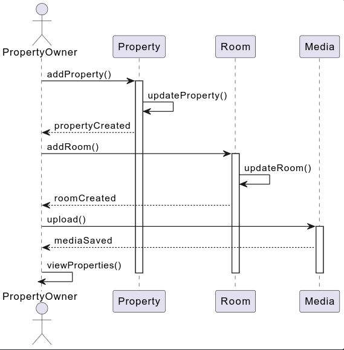

In questo diagramma di sequenza, l’attore PropertyOwner rappresenta un utente autenticato che gestisce le proprie proprietà. La sequenza inizia quando l’owner decide di creare una nuova proprietà. La chiamata parte dall’attore verso l’oggetto Property tramite il metodo addProperty(), che rappresenta la richiesta di creazione. Property si attiva e chiama internamente updateProperty() per aggiornare i dettagli della nuova proprietà; al termine, Property risponde all’owner confermando che la proprietà è stata creata, e l’oggetto Property viene disattivato.

Successivamente, l’owner gestisce le stanze associate alla proprietà. La chiamata va dall’owner verso l’oggetto Room tramite il metodo addRoom(), che rappresenta la creazione o modifica di una stanza. L’oggetto Room si attiva, esegue updateRoom() per aggiornare i dettagli della stanza e infine risponde all’owner confermando la creazione o modifica della stanza, quindi Room si disattiva.

Dopo la gestione delle stanze, l’owner può caricare media associati alla proprietà. La chiamata parte dall’owner verso l’oggetto Media tramite il metodo upload(). Media si attiva, salva i file e risponde all’owner confermando l’avvenuto salvataggio, quindi si disattiva.

Infine, l’owner può visualizzare la lista delle proprietà tramite il metodo viewProperties() sul proprio oggetto, completando il flusso di creazione e gestione di una nuova proprietà. Il diagramma rappresenta chiaramente le attivazioni degli oggetti lungo le linee temporali e mostra la sequenza logica coerente con i metodi definiti nel class diagram, rispettando la corretta direzione delle frecce dagli attori verso gli oggetti.

**Update Existing Property**

<!--  -->
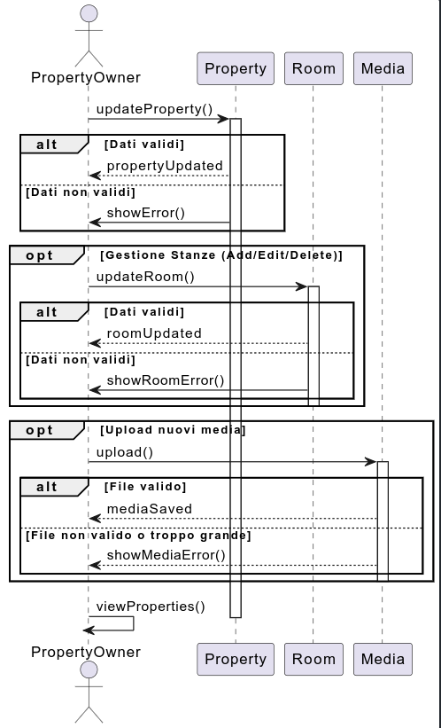

In questo scenario, l’owner invia una richiesta di aggiornamento alla proprietà esistente. Property esegue updateProperty() e risponde confermando l’aggiornamento. Successivamente l’owner può gestire le stanze tramite updateRoom(), e infine caricare eventuali nuovi media. La sequenza termina con la visualizzazione aggiornata delle proprietà dall’owner.

**Delete Property**

<!--  -->

Il diagramma mostra come un **Property Owner** elimina una proprietà dal sistema. L’owner avvia l’operazione chiamando il metodo `deleteProperty()` sulla property desiderata. Prima di cancellare la property stessa, vengono rimossi tutti i media ad essa associati: la property chiama `delete()` su ciascun media e riceve conferma della cancellazione. Successivamente, tutte le stanze collegate alla property vengono rimosse; per ciascuna stanza, la property invoca `deleteRoom()`, che a sua volta cancella tutti i media associati alla stanza. Una volta completata la rimozione dei media di ogni stanza, la stanza stessa viene eliminata e conferma la sua cancellazione alla property. Quando tutte le stanze e tutti i media sono stati rimossi, la property viene definitivamente cancellata e restituisce al Property Owner la conferma `propertyDeleted`, completando l’intera operazione di eliminazione.

**Search Property**

<!--  -->
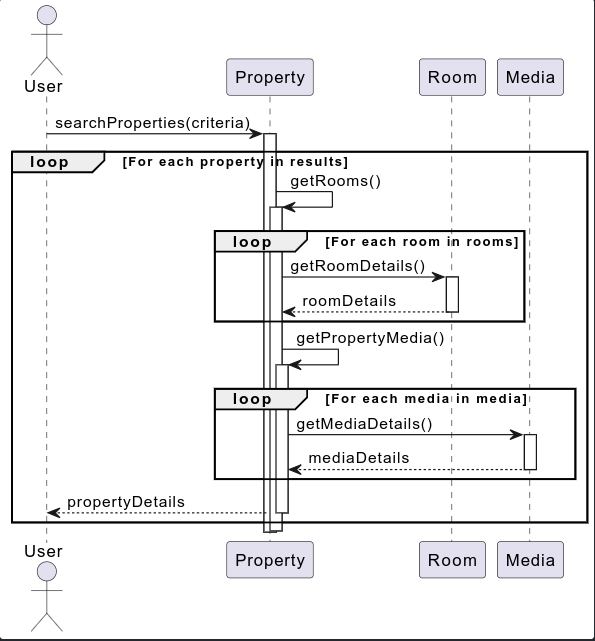

In questo scenario, l’utente avvia la ricerca delle proprietà tramite il metodo `searchProperties()` definito nella classe `User`. Questo metodo accetta i criteri di ricerca, come località, date o preferenze, e restituisce l’elenco delle proprietà corrispondenti. Per ogni proprietà trovata, il sistema chiama internamente i metodi `getRooms()` e `getMedia()` della classe `Property` per recuperare rispettivamente l’elenco delle stanze e dei media associati alla proprietà.

Ogni stanza viene poi interrogata tramite il suo metodo `getDetails()`, che restituisce le informazioni relative al tipo, prezzo, capacità e servizi disponibili. Allo stesso modo, ciascun media associato alla proprietà viene recuperato tramite `getDetails()` della classe `Media`, ottenendo informazioni come file path, tipo e descrizione.

Quando tutte le stanze e i media della proprietà sono stati raccolti, la proprietà completa, con tutti i dettagli delle stanze e dei media, viene restituita all’utente. Il diagramma rappresenta quindi un flusso sequenziale in cui l’utente riceve progressivamente tutte le informazioni necessarie sulle proprietà corrispondenti ai criteri di ricerca, senza necessità di un metodo separato di “view full property”. L’utente interagisce solo con `searchProperties()`, mentre tutte le aggregazioni di stanze e media sono gestite dalle rispettive classi associate.

### **Diagramma di Attività**

<!--  -->

L’attività inizia quando il Property Owner sceglie di creare una nuova proprietà e inserisce i dati necessari. Il sistema valida le informazioni e, se corrette, registra la nuova proprietà. Successivamente, l’owner può opzionalmente aggiungere una o più stanze e caricare media associati (foto o video). Infine, il sistema conferma l’avvenuta creazione e mostra la proprietà nella lista personale dell’utente.

### **BPMN**

**Create new Property BPMN**
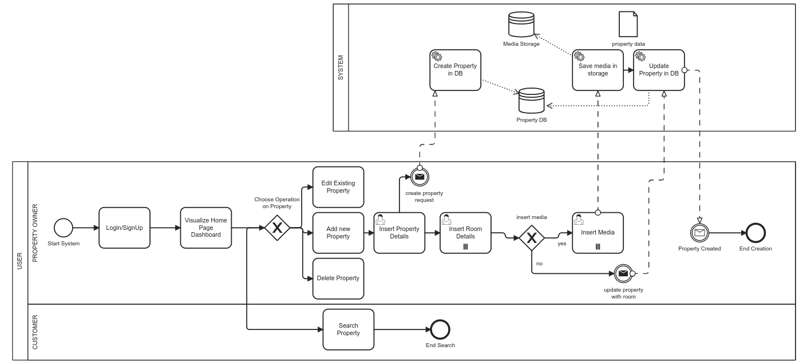

Il diagramma rappresenta un processo di gestione e creazione di proprietà (con stanze e eventualmente media) nel sistema, mostrando le interazioni tra due ruoli principali: Property Owner (proprietario della proprietà) e Customer (cliente), e il sistema stesso.

Il flusso inizia quando l’utente entra nel sistema, passando attraverso il login o la registrazione. Dopo il login, il proprietario visualizza il dashboard della home page, da cui può scegliere l’operazione da compiere sulla proprietà: modificare una proprietà esistente, aggiungerne una nuova oppure eliminarne una. Se decide di aggiungere una nuova proprietà, deve inserire prima i dati della proprietà e poi i dettagli delle stanze.

A questo punto viene chiesto se vuole inserire media (foto o video). Se la risposta è sì, il proprietario carica i media. Questi vengono salvati nel media storage del sistema, e successivamente i dati della proprietà vengono creati nel database. Alla fine, il sistema invia una notifica di conferma al proprietario e il processo di creazione termina.

Se il proprietario decide di non inserire media, viene comunque generata una richiesta di creazione della proprietà, che passa al sistema per essere registrata.

Il Customer, invece, ha solo la possibilità di cercare proprietà e terminare la ricerca, senza interagire con la creazione o modifica delle proprietà. 

---

### **Class Diagram di Design**

<!--  -->

**Questo diagramma rappresenta l’architettura generale del nostro sistema**, strutturata in più livelli (**layered architecture**).
Abbiamo separato chiaramente le responsabilità in modo che **ogni parte faccia solo una cosa**:
**API layer**, **Service layer**, **Domain layer**, **DTO layer**, e **Repository/Storage layer**.

L’obiettivo di questa architettura è **mantenere il codice chiaro, manutenibile e facilmente estendibile**:
se in futuro cambiamo **database**, **provider di storage** o **sistema di autenticazione**, la logica di business e il dominio restano invariati.
Ogni livello ha responsabilità ben definite e comunica solo con il livello adiacente.

Le **classi API** (`PropertyAPI`, `RoomAPI`, `MediaAPI`, `SearchAPI`, `AuthAPI`) rappresentano il **punto di contatto tra il mondo esterno e il sistema**.
Nel frontend, possiamo immaginarle come **client REST**: contengono i metodi che inviano richieste HTTP verso il backend (es. `createProperty()`, `getProperty()`, `searchProperties()`), nascondendo i dettagli tecnici delle chiamate di rete.

Nel **backend**, invece, le API corrispondono agli **endpoint dell’applicazione**: ogni endpoint espone una funzionalità specifica (creazione, aggiornamento, ricerca, ecc.).
Quando una richiesta arriva, l’endpoint:

1. **Valida i dati in ingresso**,
2. **Autentica l’utente** se necessario,
3. **Delega la logica di business** al Service corrispondente.

In questo modo, **gli endpoint restano semplici e leggibili**, si limitano a gestire richiesta e risposta mentre **la logica applicativa è centralizzata nei Service**.

I **DTO (Data Transfer Object)** servono per **mantenere il dominio pulito e indipendente dai dettagli tecnici**.
Senza i DTO, le API dovrebbero creare o modificare direttamente le entità del dominio (come `Property` o `User`), esponendole al rischio di essere costruite con **dati incompleti**, **campi non validi** o **formati errati**.

Usando i DTO, invece, **si crea uno strato di sicurezza e separazione**:
le API ricevono i dati dal mondo esterno (ad esempio un JSON), li mappano su oggetti semplici (`PropertyData`, `UserData`, ecc.), e solo dopo li passano al Service.
Il Service è l’unico responsabile di **trasformare i DTO in vere entità del dominio**, rispettando **regole, vincoli e logica interna**.

In questo modo:

- **Il dominio è protetto** da input malformati o modifiche accidentali.
- **Le API restano flessibili**, potendo cambiare formato di input/output senza toccare la logica interna.
- **I test diventano più semplici**, perché i Service possono essere testati isolatamente con DTO controllati.

I DTO quindi separano **“come i dati arrivano”** da **“come i dati vivono nel dominio”**, mantenendo il codice **sicuro, stabile e facile da evolvere**.

I **Service** contengono la **logica di business** dell’applicazione.
Ricevono i DTO, **applicano le regole del dominio** (tramite strategie o validator), **costruiscono gli oggetti di dominio corretti** (eventualmente usando **Builder** o **Factory**) e gestiscono le operazioni complesse come **pubblicazioni, aggiornamenti o upload di media**.

Ogni Service comunica solo con **interfacce astratte** (`IPropertyRepository`, `IMediaStorage`, `IAuthProvider`, ecc.), e non con implementazioni concrete.
Questo garantisce **basso accoppiamento** e **alta sostituibilità**: possiamo cambiare tecnologia (DB, storage, provider esterno) senza modificare la logica del Service o il dominio.

**Il Domain layer** contiene le nostre entità principali (`Property`, `Room`, `Media`, `User`).
Queste classi rappresentano il “cuore” del sistema: hanno metodi e regole che definiscono come devono comportarsi (ad esempio `canBePublished()` o `addRoom()`).
Non sanno nulla del database o delle API: sono completamente isolate.

**Il Repository/Storage layer** si occupa di salvare e recuperare i dati.
Abbiamo interfacce come `IPropertyRepository` o `IMediaStorage` e poi implementazioni concrete (`PropertyRepositoryImpl`, `S3MediaStorage`, ecc.).
Così se un giorno passiamo da un database SQL a uno NoSQL, basta cambiare l’implementazione, non il resto del sistema.

**Builder Pattern**
Il **Builder Pattern** è un pattern creazionale che serve per **costruire oggetti complessi passo per passo**, separando la logica di costruzione dalla rappresentazione finale.
Invece di avere un costruttore con decine di parametri (spesso difficili da leggere o mantenere), il builder fornisce **un’interfaccia fluente** con metodi come `withDescription()`, `addRoom()`, `withStatus()`, ecc.
Alla fine si chiama un metodo come `build()` per ottenere l’oggetto finale.

Nel nostro caso, lo usiamo per costruire entità del dominio come **`Property`**.
La classe **`PropertyBuilder`** centralizza tutta la logica di creazione, assicurandosi che la `Property` sia **coerente e valida** prima di restituirla.
Il **Service** riceve un `PropertyData` (DTO), lo passa al builder, e ottiene una `Property` pronta da salvare o pubblicare.
Questo approccio è particolarmente utile perché:

- gestisce facilmente **campi opzionali** o **dipendenze tra attributi** (es. una proprietà può avere o meno delle stanze, ma se ne ha, vanno aggiunte correttamente);
- mantiene **pulita la logica di costruzione**, evitando che il service debba preoccuparsi di dettagli interni.

**Factory Method**
Il **Factory Method Pattern** è un pattern creazionale che definisce **un’interfaccia per creare oggetti**, lasciando però alle sottoclassi la decisione su quale oggetto concreto istanziare.
Questo evita di usare `new` in giro per il codice e mantiene le dipendenze flessibili.

Nel nostro progetto lo usiamo per gestire la creazione delle **amenity** (i servizi offerti da una proprietà o da una stanza).
Abbiamo una **interfaccia astratta** `IAmenityFactory` e implementazioni come `PropertyAmenityFactory` e `RoomAmenityFactory`.
Il vantaggio è che, se vogliamo aggiungere un nuovo tipo di amenity (es. “PetFriendlyAmenity”), ci basta creare una nuova factory **senza modificare il codice esistente**.

Questo rispetta il **principio Open/Closed** (Open for extension, Closed for modification):
possiamo aggiungere nuove varianti senza toccare le classi già scritte.

**Strategy Pattern**
Lo **Strategy Pattern** è un pattern comportamentale che consente di **definire una famiglia di algoritmi** (strategie), incapsularli in classi separate e renderli **intercambiabili a runtime**.
L’idea è evitare `if` o `switch` infiniti e rendere il comportamento del sistema flessibile.

Nel nostro dominio lo applichiamo per la **validazione delle entità**.
Abbiamo un **`ValidatorContext`** che seleziona e usa la giusta strategia di validazione:

- `PropertyValidationStrategy` per le regole sulle proprietà;
- `RoomValidationStrategy` per le regole sulle stanze.

Ogni strategia implementa le proprie regole, come:

- una **property** non può essere pubblicata senza almeno una stanza;
- una **room** non può avere **prezzo negativo** o **capacità zero**.

Il vantaggio è che possiamo **aggiungere o modificare regole** semplicemente creando una nuova strategia, senza toccare il codice principale.
Inoltre, le strategie sono **facilmente testabili** in modo isolato.

**Bridge Pattern**
Il **Bridge Pattern** è un pattern strutturale che serve a **separare un’astrazione dalla sua implementazione**, in modo che entrambe possano evolversi indipendentemente.
È molto utile quando si vuole evitare un’eccessiva dipendenza tra logica e tecnologia.

Nel nostro sistema lo abbiamo usato per la **gestione dei media**.
La parte astratta è il **`MediaManager`**, che contiene la logica di business: gestisce l’upload dei file, la creazione dei metadati, il collegamento con la `Property`, la generazione di miniature, ecc.
L’implementazione concreta è definita tramite l’interfaccia **`IMediaStorage`**, che può avere più versioni: `S3Storage`, `OpenStackStorage`, `LocalStorage`, ecc.

In questo modo, possiamo **cambiare lo storage** (ad esempio passare da AWS S3 ad un altro servizio) senza toccare la logica applicativa.
Il Bridge Pattern ci permette quindi di mantenere **alta coesione** e **basso accoppiamento** tra logica e tecnologia.

**MediaManager**
Il **MediaManager** è un componente **trasversale**, non un semplice service.
Centralizza tutte le operazioni legate ai file multimediali: **upload, salvataggio, generazione di versioni, collegamento ai domini (`Property`, `Room`) e sincronizzazione con lo storage**.

Grazie al Bridge Pattern, il `MediaManager` si appoggia a un’astrazione (`IMediaStorage`) invece che a un’implementazione specifica.
Questo significa che il `MediaManager` si occupa **della logica applicativa**, mentre lo storage effettivo (cloud o locale) può cambiare liberamente.

**Relazioni tra Service e Repository**
È normale che un service abbia più repository.
Per esempio, `PropertyService` può usare `IRoomRepository` e `IMediaRepository` perché una property ha stanze e media collegati.
Questo non è un problema: i service orchestrano le operazioni ma restano indipendenti tra loro.
Non devono mai chiamarsi direttamente, ma condividere le stesse interfacce.

**Auth Layer**
`AuthAPI`, `AuthService`, `IAuthProvider`, `AWSCognitoAuthProvider` gestiscono tutta la parte di autenticazione.
Abbiamo separato la logica applicativa dalla tecnologia usata (es. Cognito), così se domani usiamo un altro provider possiamo sostituirlo facilmente.
I token vengono gestiti fuori dal dominio, e l’API si occupa solo di validare le richieste tramite header o cookie.

Le **validazioni (nell'API layer)** controllano il formato e i tipi dei dati in ingresso (es. campi obbligatori, tipo email valida).
Le **validazioni di business** (nel Service/Domain) applicano invece le regole logiche dell’app (es. non puoi pubblicare una property senza stanze).
Dividere i due livelli di validazione rende il codice più chiaro e facilita il debugging.

**TODO** spiegare API GATEWAY pattern microservizi

https://www.geeksforgeeks.org/system-design/microservices-design-patterns/

### **Package Diagram di Design**

<!--  -->
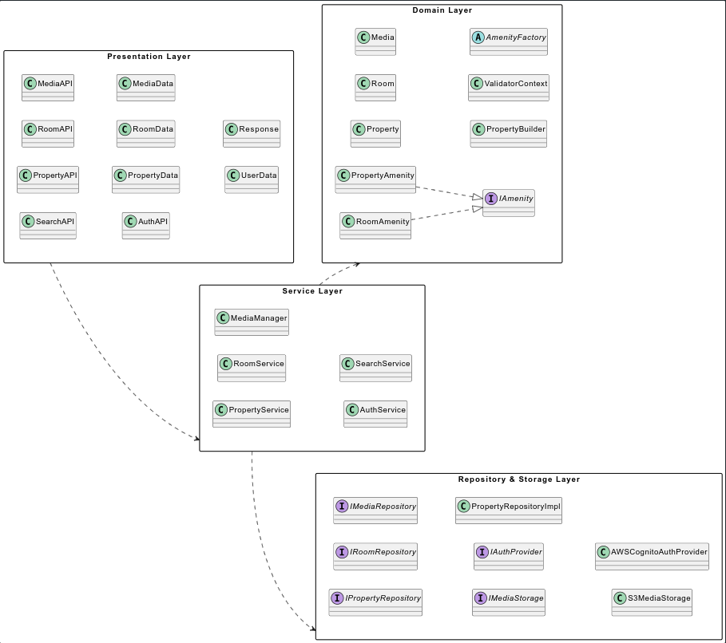

Un **package diagram** è uno strumento UML usato per **raggruppare e organizzare elementi del modello** in insiemi logici (**package**). Serve a **visualizzare le dipendenze ad alto livello** tra i vari pezzi del sistema, riducendo il rumore dei dettagli implementativi.

Quando si parla di **package diagram di analisi**, l'obiettivo è **mappare concetti del dominio e casi d'uso** in grandi raggruppamenti semanticamente coerenti: si scoprono i confini funzionali e si valuta la **coesione** e le **dipendenze** fra parti dell'applicazione, senza dettagliare classi o interfacce concrete.

Il **package diagram di design**, invece, scende un livello più vicino al codice: mostra **come i package analitici vengono realizzati** tramite componenti software, interfacce, implementazioni e sottosistemi. Nel design si definiscono **responsabilità più concrete**, **contratti (interfacce)** e **punti di estensione** (factory, repository, provider esterni).

Separare in package aiuta a ottenere **alta coesione interna** e **basso accoppiamento esterno**: ogni package deve contenere elementi strettamente correlati e offrire **poche API pubbliche** verso l’esterno.
Questo rende più semplice **il testing**, **la sostituzione delle implementazioni** e **la comprensione dell’architettura**.

Nei package di design è importante esplicitare **dipendenze chiare e direzionali** (un package che dipende da un altro non dovrebbe creare dipendenze circolari) e favorire l’uso di **interfacce come contratti**, così da **limitare l’impatto dei cambiamenti tecnologici**.

Nel nostro diagramma abbiamo **cinque grandi package** che riflettono i layer architetturali:
**Presentation Layer (API)**, **DTO Layer**, **Service Layer**, **Domain Layer**, **Repository & Storage Layer**.

L’intento è avere **confini netti**:
le **API** si occupano dell’interazione esterna e della mappatura input/output,
i **DTO** isolano la forma dei dati,
i **Service** gestiscono la logica di business,
il **Domain** contiene le entità e i pattern di dominio (builder, validator, factory),
e le **Repository/Storage** incapsulano persistenza e provider esterni.

**Presentation → DTO → Service → Domain/Repository**.
Questo schema chiarisce che **gli endpoint o le API client-side non accedono mai direttamente al database o allo storage**, ma passano sempre attraverso i Service e i contratti definiti dalle interfacce.

### **Component Diagram**

<!--  -->
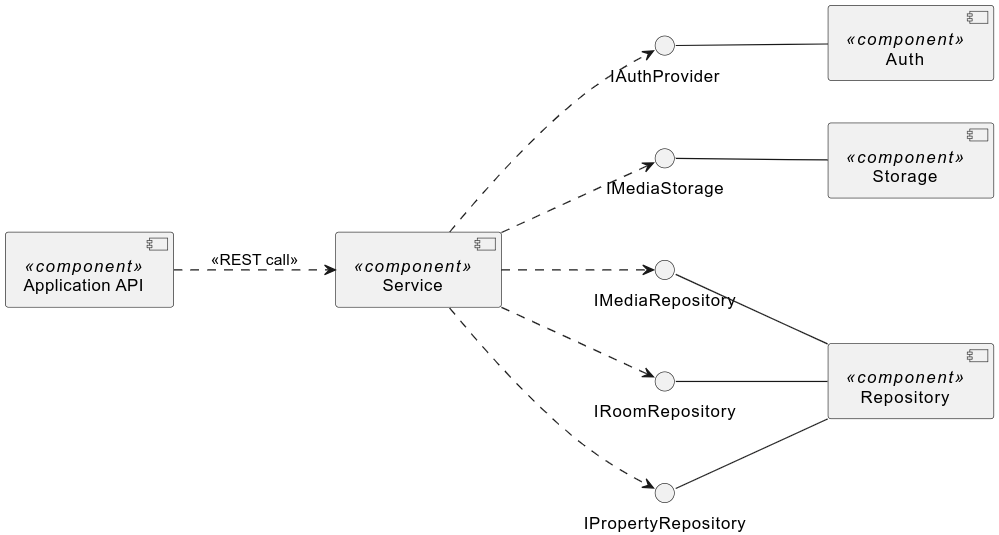

Il diagramma rappresenta l’architettura generale del sistema organizzata in **componenti principali**, con chiara separazione dei livelli. I componenti mostrati sono `Application API`, `Service`, `Repository`, `Storage` e `Auth`, e le interfacce `IPropertyRepository`, `IRoomRepository`, `IMediaRepository`, `IMediaStorage` e `IAuthProvider` definiscono i contratti tra i livelli.

Il componente **`Application API`** racchiude tutte le classi che espongono le funzionalità verso l’esterno, come `PropertyAPI`, `RoomAPI`, `MediaAPI`, `SearchAPI` e `AuthAPI`. Rappresenta quindi il **punto di ingresso del sistema**, sia lato client (come client REST) sia lato server (come endpoint REST). Le frecce tratteggiate che lo collegano a `Service` indicano una **richiesta concettuale di servizio** tramite REST, mostrando il flusso logico delle chiamate senza rappresentare una dipendenza concreta a livello di codice.

Il componente **`Service`** centralizza la logica di business del sistema. Si occupa di orchestrare le operazioni complesse, applicare le regole del dominio, validare i dati e trasformare i DTO in entità del dominio. Le frecce tratteggiate verso le interfacce dei repository e dello storage (`IPropertyRepository`, `IRoomRepository`, `IMediaRepository`, `IMediaStorage` e `IAuthProvider`) indicano che il service **dipende dalle interfacce**, così è facile sostituire le implementazioni concrete senza cambiare la logica di business.

Le interfacce rappresentano i **punti di accesso ai componenti concreti**. I componenti concreti `Repository`, `Storage` e `Auth` forniscono le implementazioni delle interfacce, permettendo al service di usarle senza sapere i dettagli interni. In questo modo il sistema resta flessibile e facile da testare.

- La **separazione dei livelli** tra API, Service e persistenza/storage.
- Le **interfacce come contratti astratti**, utilizzate per ridurre il coupling e aumentare la flessibilità.
- Le frecce tratteggiate tra `Application API` e `Service` e tra `Service` e le interfacce indicano **dipendenze concettuali o richieste di servizio**, mentre le frecce piene verso l’alto mostrano la **realizzazione concreta delle interfacce**.
- `Application API` agisce come contenitore di tutte le classi API, `Service` concentra la logica di business e i componenti concreti gestiscono persistenza e autenticazione.

In questo modo il diagramma comunica chiaramente **come i componenti interagiscono** tra loro, quali dipendenze sono astratte e quali sono implementazioni concrete, mantenendo una visione pulita e adatta alla documentazione UML.

### **Design of the Onboarding Database**

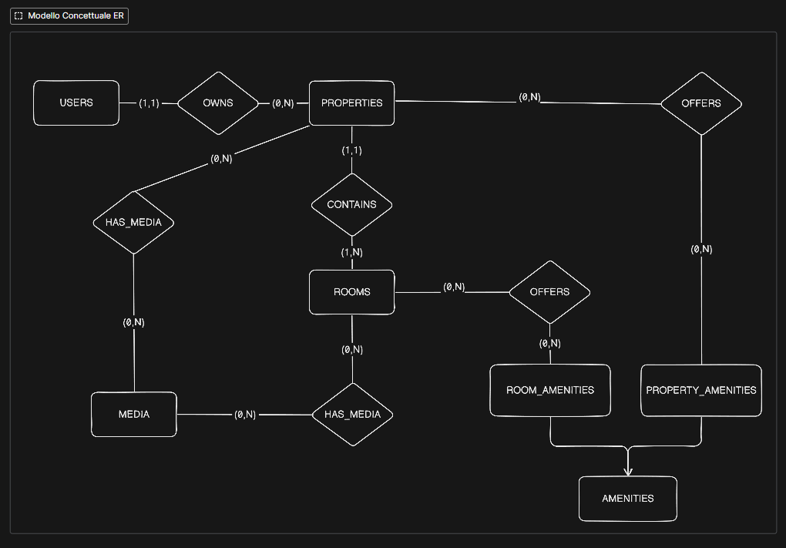

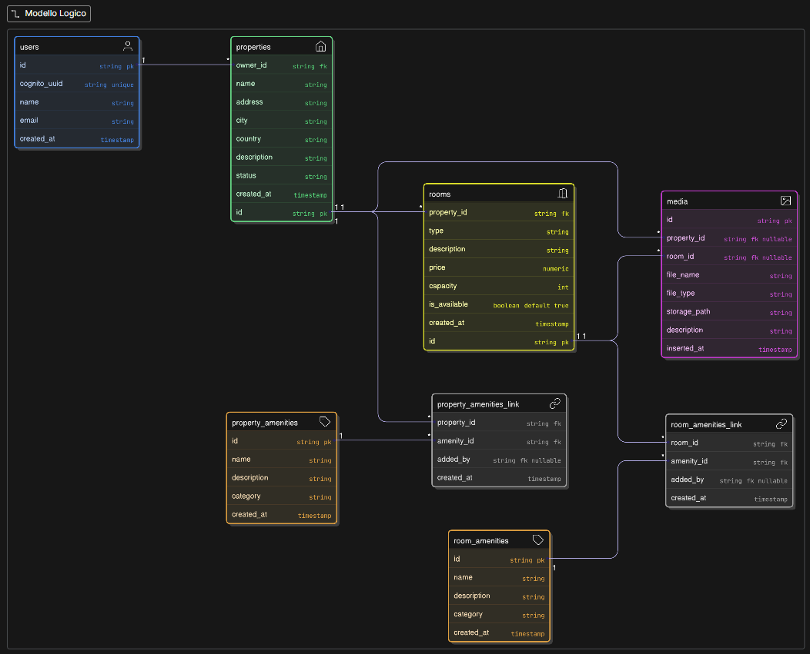

Abbiamo scelto un database relazionale per il nostro progetto perché i dati dell’applicazione presentano caratteristiche tipiche di scenari relazionali: entità distinte con attributi ben definiti, relazioni complesse tra entità, e la necessità di garantire integrità e coerenza.

- **Utenti e proprietà**: ogni utente può possedere più proprietà, ma ogni proprietà appartiene a un solo utente. Questa relazione uno-a-molti è facilmente rappresentabile tramite chiavi esterne, e garantisce che una proprietà non possa esistere senza un proprietario valido.
- **Proprietà e stanze**: una proprietà può avere diverse stanze, ognuna con caratteristiche proprie (tipo, prezzo, capacità, disponibilità). Anche qui, la relazione uno-a-molti consente query semplici per recuperare tutte le stanze di una proprietà e aggiornamenti coerenti se la proprietà viene modificata o eliminata.
- **Media associati a proprietà e stanze**: ogni file multimediale può appartenere a una proprietà o a una stanza. Utilizzare un database relazionale ci permette di definire chiaramente queste associazioni e vincolare la presenza di media solo a entità esistenti.
- **Amenities e relazioni molti-a-molti**: sia le proprietà che le stanze possono avere diverse amenities, e ogni amenity può essere condivisa da più proprietà o stanze. Le tabelle associative permettono di gestire queste relazioni in maniera chiara e scalabile, senza duplicare dati.

In scenari non relazionali (NoSQL), dovremmo replicare dati o utilizzare strutture nidificate, complicando query complesse come “tutte le stanze con amenity X di proprietà di un certo utente” o “tutti i media associati a una stanza specifica”. Il database relazionale rende queste query naturali e performanti.

**Fasi del progetto del database**

1. **Analisi dei requisiti**: identificazione delle entità principali (utenti, proprietà, stanze, media, amenities), dei loro attributi e delle regole di business principali.
2. **Definizione delle relazioni**: individuazione delle associazioni tra entità (uno-a-molti, molti-a-molti) e dei vincoli necessari per mantenere l’integrità dei dati.
3. **Modello concettuale (ER)**: rappresentazione grafica delle entità come rettangoli  e delle associazioni come rombi. Si sono definite le cardinalità (es. 0..N per amenities) e generalizzazioni, come l’entità astratta **Amenity**, da cui derivano **PropertyAmenity** e **RoomAmenity**.
4. **Modello logico**: traduzione del modello concettuale in tabelle relazionali, chiavi primarie e chiavi esterne. Le relazioni uno-a-molti sono implementate tramite chiavi esterne, mentre le relazioni molti-a-molti tramite tabelle associative (link). Attributi come `created_at` o `inserted_at` sono stati aggiunti per tracciare le informazioni temporali, mentre campi come `category` nelle amenities consentono una classificazione utile alle query.

**Modello concettuale (ER)**

- **Entità principali**: `User`, `Property`, `Room`, `Media`, `PropertyAmenity`, `RoomAmenity`.
- **Attributi chiave**: identificatori univoci per ogni entità, campi descrittivi come nome, descrizione, tipo, prezzo, città, paese.
- **Relazioni**:

  - **User → Property**: uno-a-molti, “owns”.
  - **Property → Room**: uno-a-molti, “contains”.
  - **Property → PropertyAmenity**: molti-a-molti, “offers”, tramite losanga e frecce con cardinalità (0,N)-(0,N).
  - **Room → RoomAmenity**: molti-a-molti, “offers”, stesso schema.
  - **Property/Room → Media**: uno-a-molti, “has_media”.
- **Generalizzazione**: entità astratta **Amenity** da cui derivano PropertyAmenity e RoomAmenity, condividendo attributi comuni.

**Modello logico**

- **Trasformazione del concettuale in tabelle**: ogni entità diventa una tabella, ogni attributo diventa una colonna.
- **Relazioni uno-a-molti**: implementate tramite chiavi esterne nella tabella figlia (es. `property_id` in `rooms`).
- **Relazioni molti-a-molti**: implementate tramite tabelle associative (`property_amenities_link`, `room_amenities_link`) con chiavi composte e riferimenti alle entità correlate.

**Progettazione fisica (PostgreSQL su RDS/Aurora):**
In questa fase traduciamo il modello logico in una struttura concreta che sarà effettivamente salvata nel database.

- Ogni tabella ha **tipi di campo adeguati**: UUID per gli ID, VARCHAR/TEXT per nomi e descrizioni, TIMESTAMP per date, NUMERIC per prezzi e valori numerici.
- Le **foreign key (FK)** garantiscono l’integrità referenziale tra le tabelle, assicurando che i collegamenti tra proprietà, stanze, media e amenities siano coerenti.
- Creiamo **indici mirati** per ottimizzare le query più importanti degli utenti:

  - `properties(city, country, status)` → permette di filtrare velocemente le proprietà per città, paese o stato.
  - `rooms(property_id)` → consente di recuperare rapidamente tutte le stanze associate a una specifica proprietà.
  - `property_amenities_link(property_id)` e `room_amenities_link(room_id)` → velocizzano la ricerca delle amenities collegate a una proprietà o a una stanza.

Gli indici sono scelti **solo per le query critiche di ricerca**, così da migliorare le prestazioni senza appesantire il database con indici inutili.

### **Architettura Cloud**

    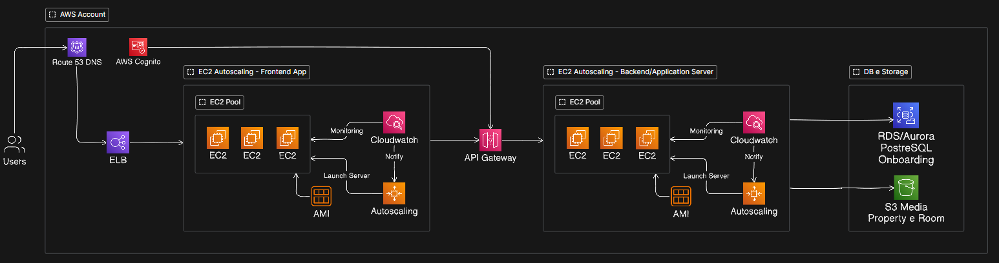

Questa architettura AWS rappresenta una soluzione **multi-tier** (a più livelli) e **microservizi** altamente ottimizzata per la **scalabilità orizzontale (Scale Out)** e la **resilienza**.

Il punto di ingresso per gli **Utenti** è **Route 53 DNS**, che si occupa della **risoluzione del nome di dominio** reindirizzando il traffico all'applicazione. L'autenticazione è gestita in modo centralizzato da **AWS Cognito**, che funge da **Identity Provider** per la registrazione e l'accesso degli utenti, integrandosi con l'account AWS.

Il traffico destinato all'interfaccia utente viene intercettato da un **ELB (Elastic Load Balancer)**. Il suo ruolo cruciale è distribuire equamente il carico di lavoro tra le istanze **EC2** attive all'interno del **Pool EC2**. Questo garantisce che nessun singolo server venga sovraccaricato e che l'applicazione rimanga disponibile anche in caso di guasto di un'istanza.

Lo strato di **Frontend** implementa in modo rigoroso il **Cloud Pattern Scale Out** [https://en.clouddesignpattern.org/index.php/CDP_Scale_Out_Pattern.html](https://en.clouddesignpattern.org/index.php/CDP_Scale_Out_Pattern.html). La logica è la seguente:
1. **Cloudwatch** monitora costantemente le metriche operative (come l'utilizzo della CPU, la latenza o il numero di richieste) delle istanze EC2.
2. Quando queste metriche superano soglie predefinite, **Cloudwatch** invia una notifica al servizio di **Autoscaling**.
3. L'**Autoscaling** risponde lanciando automaticamente nuove istanze EC2 basate su un'**AMI (Amazon Machine Image)** preconfigurata.
Questo processo automatico consente all'applicazione di **aumentare o diminuire la capacità computazionale** per far fronte a variazioni improvvise del carico, gestendo la scalabilità orizzontalmente.

Il frontend non accede direttamente al backend, ma instrada le richieste tramite l'**API Gateway**. Questo servizio agisce come un **punto di accesso unificato**, gestendo la sicurezza (autorizzazione, limitazione del rateo), il routing e la trasformazione delle richieste verso i servizi di backend.

Il **Backend/Application Server** è strutturato con la stessa logica di scalabilità del frontend. Anch'esso è composto da un **Pool EC2** e gestito da un gruppo di **Autoscaling** supervisionato da **Cloudwatch**. Questa duplicazione del meccanismo di **Scale Out** assicura che anche la logica di business e l'elaborazione dei dati possano scalare in modo indipendente e dinamico rispetto all'interfaccia utente.

L'architettura separa chiaramente lo storage, aderendo al **CDP Web Storage Pattern** [https://en.clouddesignpattern.org/index.php/CDP_Web_Storage_Pattern.html](https://en.clouddesignpattern.org/index.php/CDP_Web_Storage_Pattern.html), per ottimizzare prestazioni, costi e durabilità:
1. **RDS/Aurora PostgreSQL:** Questo è il database relazionale gestito per i dati strutturati (ad esempio, profili utente, transazioni, configurazioni). **RDS/Aurora** offre **alta disponibilità**, **scalabilità** verticale e orizzontale (tramite repliche di lettura) e gestisce automaticamente backup e patch.
2. **S3 Media Property e Room:** **Amazon S3 (Simple Storage Service)** è utilizzato per lo storage di oggetti non strutturati e statici, come i file multimediali. S3 offre **durabilità estrema** e una **scalabilità praticamente illimitata**, rendendolo la soluzione ideale per archiviare grandi volumi di dati come immagini e video, sgravando il database relazionale da questo compito.

